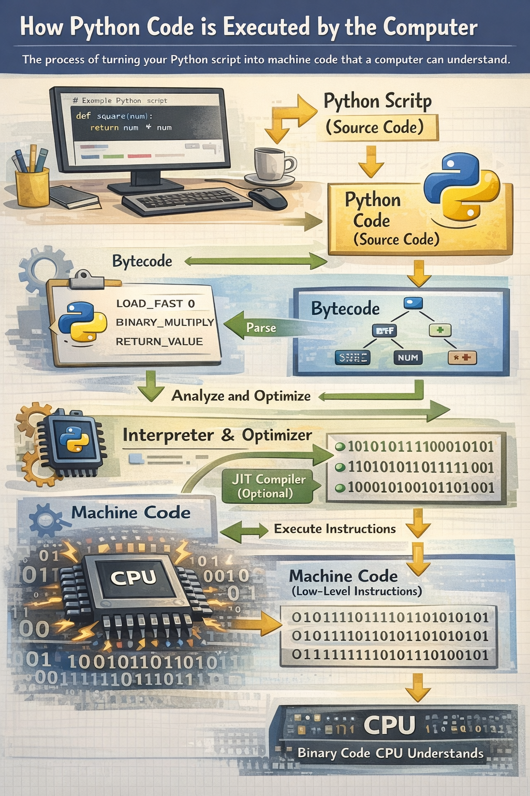

<div align="center">
  
</div>
---

## 🔹 1. Sen kod yozasan (Source Code)

Masalan:

```python
print("Salom")
```

Bu — **inson o‘qiy oladigan kod** (`.py` fayl).

📌 Kompyuter buni to‘g‘ridan-to‘g‘ri tushunmaydi.

---

## 🔹 2. Python avval tekshiradi (Parsing + Syntax Check)

Python:

✅ Xato bormi?

✅ Indentation to‘g‘rimi?

✅ Qoidaga mosmi?

Agar xato bo‘lsa → ishlamaydi.

Bu bosqich: **Syntax Analysis**

---

## 🔹 3. Bytecode ga aylantiradi (Compile qiladi)

Keyin Python kodingni:

👉 **Bytecode** ga aylantiradi

Misol:

```
LOAD_NAME
CALL_FUNCTION
PRINT
```

Bu:

* Oddiy odam uchun qiyin
* Lekin mashina kodi ham emas

📌 Bu — **o‘rtacha til**

Bu jarayon:
👉 **Compilation to Bytecode**

---

## 🔹 4. .pyc fayl (kesh) yaratadi (ba’zan)

Agar dastur katta bo‘lsa:

Python bytecode ni saqlaydi:

```
__pycache__/
   main.cpython-311.pyc
```

Keyin tezroq ishlaydi ⚡

---

## 🔹 5. Python Virtual Machine ishga tushadi (PVM)

Bytecode endi:

👉 **Python Virtual Machine** ga kiradi

Bu — Python ichidagi “kichik kompyuter” 🧠

U:

* Har bir buyruqni
* Navbat bilan
* Bajaradi

📌 Asosiy ijro shu yerda bo‘ladi.

---

## 🔹 6. Mashina kodiga aylantiriladi (CPU uchun)

PVM:

👉 Bytecode → Mashina tili (0 va 1)

Masalan:

```
01010101
11001010
```

Endi CPU tushunadi ✅

Bu jarayonni OS + CPU bajaradi.

---

## 🔹 7. CPU bajaradi (Execute)

Oxiri:

💻 Protsessor:

* Hisoblaydi
* Chop etadi
* Fayl ochadi
* Internetga chiqadi

Va natija chiqadi 👇

```
Salom
```

---

# ✅ Umumiy sxema (eng muhim joyi)

Qisqa qilib:

```
1. Python code (.py)
        ↓
2. Tekshiradi (Syntax)
        ↓
3. Bytecode ga aylantiradi
        ↓
4. Python Virtual Machine
        ↓
5. Machine Code (0/1)
        ↓
6. CPU bajaradi
```

---

# 🎯 Bu jarayon nima deb ataladi?

Rasmiy nomlari:

### 1️⃣ Interpretation (Asosiy nomi)

Python — **interpreted language**

Ya’ni:

👉 Oldindan to‘liq mashina kod qilmaydi
👉 Ishlayotganda tarjima qiladi

---

### 2️⃣ Bytecode Compilation

Python:

👉 Avval bytecode ga “compile” qiladi

Shuning uchun u to‘liq interpretator ham emas.

---

### 3️⃣ Python Execution Model

To‘liq nomi:

👉 **Python Execution Model**

---

# ⚠️ Muhim farq (C++ bilan solishtirsak)

### C++:

```
Code → EXE → Machine code → CPU
```

### Python:

```
Code → Bytecode → PVM → CPU
```

Shuning uchun:

✅ Python sekinroq

✅ Lekin osonroq

---