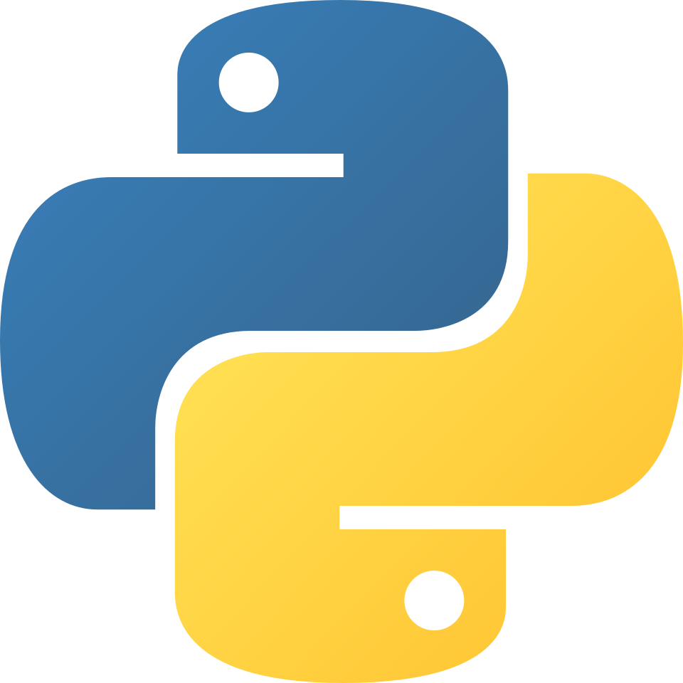

# 🐍 **PYTHON CORE MASTER ROADMAP**
## *From Zero to Senior — Complete Reference*

<div align="center">
  
</div>

<br>

<div align="right">
  <strong>Elmurod Azodov</strong><br>
  <strong>@the_elmurod</strong><br>
  <em>Version 3.0 — Final Edition</em><br>
  <em>2026, Python 3.14+</em>
</div>

<br>

---

# 📋 **MUNDARIJA**

| Bo'lim | Sahifa |
|--------|--------|
| 🟢 **STAGE 0-5: Foundations** | 2-8 |
| 🟡 **STAGE 6-11: Core Structures** | 9-18 |
| 🔵 **STAGE 12-15: OOP & Advanced** | 19-32 |
| 🟠 **STAGE 16-18: Professional** | 33-45 |
| 🔴 **STAGE 19-22: Senior & Mastery** | 46-58 |
| 🇺🇿 **O'zbekcha Versiya** | 59-85 |
| ⏱️ **Vaqt Jadvali** | 86-90 |
| 📚 **Resurslar** | 91-95 |

---

<br>
<br>

# 🟢 **STAGE 0 — PROGRAMMING & PYTHON FOUNDATIONS**

**Goal:** Understand what Python is and how it executes before writing code.

<br>

## 📚 **Topics**

| # | Topic | Concept |
|---|-------|---------|
| ⚙️ | **What is Programming?** | Algorithms, programs, execution flow |
| 🧠 | **Programming Paradigms** | Imperative, OOP, Functional, Procedural |
| 🐍 | **What is Python?** | Language vs Implementation, Philosophy (Zen of Python) |
| 🔧 | **CPython** | Reference implementation, C integration |
| 🔄 | **Interpreter vs Compiler** | Difference, trade-offs, JIT (PyPy) |
| 🏃 | **Python Execution Model** | Source → Bytecode → PVM (Python Virtual Machine) |
| 📄 | **Python Files** | .py, .pyc, .pyo, .pyi (stubs) |
| 📊 | **Python Versions** | 2.x vs 3.x, EOL, Release cycle, PEP process |
| 📥 | **Installation** | python.org, pyenv, conda, distro packages |
| 💻 | **REPL** | Interactive mode, `_` special variable |
| 🚀 | **Running Scripts** | `python script.py`, shebang (`#!/usr/bin/env python3`) |
| ✏️ | **Code Editors & IDEs** | VS Code, PyCharm, Vim/Neovim, Sublime, Jupyter |
| 📝 | **Syntax Rules** | Case sensitivity, statements, line continuation |
| ↪️ | **Indentation** | 4 spaces, blocks, PEP 8, tabs vs spaces |
| 💬 | **Comments** | `#` single line, `'''` multiline, `"""` docstrings |
| 📖 | **Docstrings** | Module, function, class documentation — PEP 257 |
| 🔍 | **PEP 8** | Style guide, naming conventions |
| ❓ | **Help System** | `help()`, `dir()`, `__doc__` |

---

# 🟢 **STAGE 1 — CORE SYNTAX & EXPRESSIONS**

**Goal:** Write correct Python statements and expressions.

<br>

## 📚 **Topics**

### 📊 **Variables & Assignment**
- Dynamic typing, name rebinding
- Multiple assignment: `a, b = 1, 2`
- Variable naming rules (PEP 8)
- Constants convention (`UPPER_CASE`)
- Type annotations (`name: str = "Elmurod"`)

### 🏷️ **Keywords (35+)**
```
False, None, True, and, as, assert, async, await, break, class,
continue, def, del, elif, else, except, finally, for, from, global,
if, import, in, is, lambda, nonlocal, not, or, pass, raise,
return, try, while, with, yield
```

### 🔤 **Built-in Data Types Overview**
| Category | Types |
|----------|-------|
| None | `NoneType` |
| Numeric | `int`, `float`, `complex` |
| Sequence | `str`, `list`, `tuple`, `range`, `bytes`, `bytearray`, `memoryview` |
| Set | `set`, `frozenset` |
| Mapping | `dict` |
| Boolean | `bool` |
| Binary | `bytes`, `bytearray`, `memoryview` |
| Callable | `function`, `method`, `class`, `lambda` |

### 🔧 **Operators (Complete)**

| Category | Operators |
|----------|-----------|
| **Arithmetic** | `+`, `-`, `*`, `/`, `//`, `%`, `**` |
| **Comparison** | `==`, `!=`, `<`, `>`, `<=`, `>=` |
| **Logical** | `and`, `or`, `not` |
| **Assignment** | `=`, `+=`, `-=`, `*=`, `/=`, `//=`, `%=`, `**=`, `&=`, `|=`, `^=`, `>>=`, `<<=` |
| **Bitwise** | `&`, `\|`, `^`, `~`, `<<`, `>>` |
| **Membership** | `in`, `not in` |
| **Identity** | `is`, `is not` |
| **Walrus** | `:=` (Python 3.8+) |
| **Matrix** | `@` (Python 3.5+) |

### 📝 **Expressions & Precedence**
- PEMDAS rule
- Short-circuit evaluation
- Operator associativity
- `eval()` and safety concerns

---

# 🟢 **STAGE 2 — PYTHON OBJECT MODEL & PRIMITIVE TYPES**

**Goal:** Understand Python's object-based nature.

<br>

## 📚 **Topics**

| # | Topic | Concept |
|---|-------|---------|
| 🎯 | **Everything is Object** | Objects have: identity, type, value |
| 🆔 | **Object Identity** | `id()`, `is` operator, memory address |
| 🔄 | **Mutability** | Mutable vs Immutable, performance implications |
| 🔢 | **Integers (int)** | Arbitrary precision, `int()` constructor |
| 🔟 | **Floats (float)** | IEEE 754, precision issues, `float()` |
| 🔷 | **Complex Numbers** | `complex(3, 4)`, `3+4j`, `.real`, `.imag`, `.conjugate()` |
| ✅ | **Booleans (bool)** | `True`, `False`, `bool()` constructor, subclass of int |
| 🚫 | **NoneType** | `None`, singleton pattern, `is None` |
| 📏 | **Numeric Precision** | `decimal` module, `fractions` module |
| 🔒 | **Immutability** | Why immutable? Hashing, caching, thread safety |
| 🧬 | **Type System** | Dynamic typing, duck typing, nominal vs structural |
| 🔍 | **Type Checking** | `type()`, `isinstance()`, `issubclass()` |

---

# 🟢 **STAGE 3 — NUMBERS & MATHEMATICS**

**Goal:** Master numerical operations and precision.

<br>

## 📚 **Topics**

### 🔢 **Integers Deep Dive**
- Arbitrary precision
- Bit operations: `bin()`, `hex()`, `oct()`
- `int.bit_length()`, `int.to_bytes()`, `int.from_bytes()`
- Performance considerations

### 🔟 **Floats Deep Dive**
- IEEE 754: sign, exponent, mantissa
- Precision limitations: `0.1 + 0.2 != 0.3`
- `math.isclose()`, `sys.float_info`
- `float.as_integer_ratio()`

### 🔷 **Complex Numbers**
- Mathematical operations
- Phase, polar coordinates: `cmath.polar()`, `cmath.rect()`
- `cmath` module: `exp()`, `log()`, `sin()`, `cos()`, `sqrt()`

### 📏 **Decimal Module**
- Fixed-point arithmetic
- Context: precision, rounding, traps
- `Decimal` vs `float` performance

### 🧮 **Fractions Module**
- Rational numbers: `Fraction(2, 3)`
- Arithmetic with fractions
- Automatic reduction

### 🎲 **Random Module**
- Pseudo-random generators: `random()`, `randint()`, `choice()`, `shuffle()`
- Seeds: `seed()` reproducibility
- Cryptographic randomness: `secrets` module

### 📊 **Statistics Module**
- `mean()`, `median()`, `mode()`, `stdev()`, `variance()`
- Population vs sample statistics

---

# 🟢 **STAGE 4 — STRINGS & TEXT PROCESSING**

**Goal:** Master text handling — one of Python's greatest strengths.

<br>

## 📚 **Topics**

### 📝 **String Creation & Representation**
- Quotes: `'`, `"`, `'''`, `"""`
- Raw strings: `r'C:\Users\name'`
- Formatted strings: `f"{value}"`, `.format()`
- `str()` and `repr()` difference

### 📍 **Indexing & Slicing**
- Zero-based indexing
- Negative indices
- Slice syntax: `[start:stop:step]`
- `slice()` object
- Assignment to slices (for mutable sequences)

### 🛠️ **String Methods (Complete)**

| Category | Methods |
|----------|---------|
| **Case** | `.upper()`, `.lower()`, `.swapcase()`, `.capitalize()`, `.title()`, `.casefold()` |
| **Strip** | `.strip()`, `.lstrip()`, `.rstrip()` |
| **Split/Join** | `.split()`, `.rsplit()`, `.splitlines()`, `.join()` |
| **Find** | `.find()`, `.rfind()`, `.index()`, `.rindex()`, `.count()` |
| **Replace** | `.replace()`, `.translate()`, `.maketrans()` |
| **Check** | `.startswith()`, `.endswith()`, `.isalpha()`, `.isdigit()`, `.isalnum()`, `.isspace()`, `.isupper()`, `.islower()`, `.istitle()`, `.isnumeric()`, `.isdecimal()`, `.isprintable()` |
| **Align** | `.center()`, `.ljust()`, `.rjust()`, `.zfill()` |
| **Format** | `.format()`, `.format_map()` |

### 🎨 **String Formatting (3 Ways)**
1. **f-strings (Python 3.6+)** — RECOMMENDED
   ```python
   f"Hello {name}, you are {age:.2f} years old"
   f"{value=}"  # Python 3.8+: value=42
   f"{number:#x}"  # Hexadecimal
   f"{number:%}"  # Percentage
   ```

2. **.format() method**
   ```python
   "Hello {}, you are {}".format(name, age)
   "Hello {name}, you are {age}".format(name="Elmurod", age=25)
   ```

3. **% formatting (Legacy)**
   ```python
   "Hello %s, you are %d" % (name, age)
   ```

### 🌐 **Unicode & Encoding**
- Unicode vs ASCII
- Code points: `ord()`, `chr()`
- UTF-8, UTF-16, UTF-32
- `.encode()`, `.decode()`
- `unicodedata` module: normalization, category

### 🔍 **Regular Expressions (re module)**
- Meta characters: `. ^ $ * + ? {} [] \ | ()`
- Character classes: `\d`, `\w`, `\s`, `\D`, `\W`, `\S`
- Groups: `()` capturing, `(?:)` non-capturing
- Lookahead: `(?=...)`, `(?!...)`
- Lookbehind: `(?<=...)`, `(?<!...)`
- Flags: `re.IGNORECASE`, `re.MULTILINE`, `re.DOTALL`
- `re.compile()` for performance
- `re.match()`, `re.search()`, `re.findall()`, `re.finditer()`
- `re.sub()`, `re.split()`

---

# 🟢 **STAGE 5 — CONTROL FLOW & LOGIC**

**Goal:** Control program execution accurately.

<br>

## 📚 **Topics**

### ✅ **Boolean Logic**
- Boolean expressions
- Truthiness: what evaluates to `False`?
  ```python
  False, None, 0, 0.0, 0j, "", [], (), {}, set(), frozenset(), range(0)
  ```
- Short-circuit evaluation: `and`, `or`
- Conditional expressions (ternary): `x if condition else y`

### 🔀 **Conditional Statements**
```python
if condition:
    pass
elif another_condition:
    pass
else:
    pass
```

### 🎭 **Match/Case (Structural Pattern Matching — Python 3.10+)**
```python
match value:
    case 0:
        print("Zero")
    case 1 | 2 | 3:
        print("Small")
    case int():
        print("Integer")
    case str():
        print("String")
    case [x, y] if x == y:
        print("List with equal elements")
    case _:
        print("Default")
```

### 🔄 **Short-circuit Gotchas**
```python
# and returns first Falsy OR last value
result = 0 and 42  # 0
result = 42 and 100  # 100

# or returns first Truthy OR last value
result = 0 or 42  # 42
result = 42 or 100  # 42
```

---

# 🟢 **STAGE 6 — LOOPS & ITERATION**

**Goal:** Repeat logic safely and efficiently.

<br>

## 📚 **Topics**

### 🔄 **For Loops**
```python
for item in iterable:
    pass

for i in range(start, stop, step):
    pass

for index, item in enumerate(iterable, start=0):
    pass

for key, value in dictionary.items():
    pass

for item1, item2 in zip(iterable1, iterable2):
    pass
```

### ⏳ **While Loops**
```python
while condition:
    pass

while True:
    if break_condition:
        break
    if skip_condition:
        continue
```

### 🎮 **Loop Control**
- `break` — exit loop immediately
- `continue` — skip to next iteration
- `pass` — do nothing (placeholder)
- `else` clause — executes if loop completes without `break`

### 📦 **Nested Loops**
- Cartesian products
- Matrix traversal
- Performance considerations

### 🎨 **Common Loop Patterns**
- Accumulator pattern
- Counter pattern
- Flag pattern
- Sentinel pattern
- Early exit pattern

### 🚫 **Infinite Loops**
- Causes: `while True`, incorrect condition
- Prevention: update condition, add counter
- Keyboard interrupt: `Ctrl+C`

### ⚡ **Comprehensions (Pythonic Loops)**
```python
# List comprehension
squares = [x**2 for x in range(10) if x % 2 == 0]

# Set comprehension
unique_squares = {x**2 for x in range(10)}

# Dict comprehension
square_dict = {x: x**2 for x in range(10)}

# Generator expression
square_gen = (x**2 for x in range(10))
```

---

# 🟡 **STAGE 7 — CORE DATA STRUCTURES I (SEQUENCES)**

**Goal:** Store, access, and manipulate sequential data.

<br>

## 📚 **Topics**

### 📋 **Lists — Mutable Sequences**
```python
# Creation
lst = []
lst = list()
lst = [1, 2, 3]
lst = list(range(10))
lst = [x**2 for x in range(10)]  # comprehension

# Indexing & Slicing
lst[0]       # first element
lst[-1]      # last element
lst[1:4]     # slice
lst[::-1]    # reverse

# Methods (Complete)
lst.append(x)        # O(1)
lst.extend(iter)     # O(k)
lst.insert(i, x)     # O(n)
lst.remove(x)        # O(n) - first occurrence
lst.pop()           # O(1) - last
lst.pop(i)          # O(n)
lst.clear()         # O(n)
lst.index(x)        # O(n)
lst.count(x)        # O(n)
lst.sort()          # O(n log n)
lst.reverse()       # O(n)
lst.copy()          # O(n) - shallow

# List as Stack: append/pop (LIFO)
# List as Queue: collections.deque (FIFO)
```

### 📦 **Tuples — Immutable Sequences**
```python
# Creation
tup = ()
tup = tuple()
tup = 1, 2, 3
tup = (1, 2, 3)

# Packing & Unpacking
a, b = 1, 2          # tuple unpacking
a, *rest = [1, 2, 3] # extended unpacking (Python 3)

# Namedtuple
from collections import namedtuple
Point = namedtuple('Point', ['x', 'y'])
p = Point(10, 20)
p.x, p.y

# Immutability — cannot modify, but can contain mutable objects
tup[0] = 42  # TypeError!
tup = ([1,2], 3)
tup[0].append(4)  # ✅ Works! Tuple itself unchanged
```

### 🔢 **Range — Arithmetic Progression**
```python
# Creation
r = range(stop)           # 0..stop-1
r = range(start, stop)    # start..stop-1
r = range(start, stop, step)

# Features
len(r)           # O(1)
r[0]             # O(1) indexing
r[-1]            # O(1)
x in r           # O(1) for integers! Not O(n)
r.index(x)       # O(1) or O(log n) for large ranges

# Memory efficiency
import sys
sys.getsizeof(range(1_000_000))   # 48 bytes!
sys.getsizeof(list(range(1_000_000)))  # ~8,000,000 bytes

# Hashable — can be dict key!
cache = {range(10): "values"}
```

### 🔪 **Slice Objects**
```python
# Slice object creation
s = slice(1, 10, 2)
s.start, s.stop, s.step

# Named slices (clean code!)
FIRST_QUARTER = slice(0, 3)
SECOND_QUARTER = slice(3, 6)
data = [10, 20, 30, 40, 50, 60]
data[FIRST_QUARTER]  # [10, 20, 30]

# Custom __getitem__ with slice
class CustomList:
    def __getitem__(self, key):
        if isinstance(key, slice):
            return f"Slice {key.start}:{key.stop}:{key.step}"
        return f"Index {key}"
```

---

# 🟡 **STAGE 8 — CORE DATA STRUCTURES II (SETS & DICTS)**

**Goal:** Master hash-based data structures.

<br>

## 📚 **Topics**

### 🔢 **Sets — Unordered Collections of Unique Elements**
```python
# Creation
s = {1, 2, 3}
s = set([1, 2, 3])
s = {x for x in range(10) if x % 2 == 0}  # comprehension

# Methods
s.add(x)           # O(1) average
s.remove(x)        # O(1) — KeyError if missing
s.discard(x)       # O(1) — no error
s.pop()            # O(1) — arbitrary element
s.clear()          # O(n)
s.copy()           # O(n)

# Set Operations (with operators)
s1 | s2           # union
s1 & s2           # intersection
s1 - s2           # difference
s1 ^ s2           # symmetric difference

# Set Operations (with methods)
s1.union(s2)
s1.intersection(s2)
s1.difference(s2)
s1.symmetric_difference(s2)
s1.issubset(s2)
s1.issuperset(s2)
s1.isdisjoint(s2)

# Hashable requirement: elements must be immutable
s = {[1,2]}       # TypeError: unhashable type: 'list'
```

### ❄️ **Frozenset — Immutable Sets**
```python
# Creation
fs = frozenset([1, 2, 3])
fs = frozenset({1, 2, 3})

# Immutable — cannot add/remove
fs.add(4)         # AttributeError!

# Hashable — can be dict key!
d = {frozenset([1,2]): "value"}

# Set of sets (impossible with normal sets)
set_of_sets = {frozenset({1,2}), frozenset({3,4})}

# All set operations work (return frozenset)
fs1 | fs2
fs1 & fs2
```

### 📖 **Dictionaries — Key-Value Mapping**
```python
# Creation
d = {}
d = dict()
d = {'a': 1, 'b': 2}
d = dict(a=1, b=2)           # keys must be valid identifiers
d = dict([('a',1), ('b',2)])
d = {x: x**2 for x in range(5)}  # comprehension
d = dict(zip(keys, values))

# Methods
d[key] = value        # O(1) average
d[key]                # O(1) — KeyError if missing
d.get(key)            # O(1) — returns None if missing
d.get(key, default)   # with default
d.setdefault(key, default)  # set if missing, return value
d.update(other_dict)  # merge
d.pop(key)            # remove and return
d.popitem()           # remove and return (key, value) — LIFO since 3.7
d.clear()             # remove all
d.copy()              # shallow copy

# View Objects (dynamic views!)
d.keys()              # dict_keys
d.values()            # dict_values
d.items()             # dict_items

# Python 3.7+: insertion order preserved!
# Python 3.6: CPython implementation detail

# Hashing Requirements
# Keys must be hashable (immutable or implements __hash__)
d[[]] = 42            # TypeError!
d[()] = 42            # ✅ works
d[frozenset([1])] = 42  # ✅ works

# Missing Key Handling — __missing__ hook
class DefaultDict(dict):
    def __missing__(self, key):
        return f"Key {key} not found!"

class AutoListDict(dict):
    def __missing__(self, key):
        value = []
        self[key] = value
        return value
```

### 🔬 **Memoryview — Zero-Copy Buffer Protocol**
```python
# Creation
data = b'hello world'
mv = memoryview(data)

# Zero-copy slicing
slice = mv[6:11]     # no copy, shares memory
slice.tobytes()      # b'world'

# Casting
mv = memoryview(b'\x01\x02\x03\x04')
mv.cast('H')         # reinterpret as unsigned short

# Performance
with open('large_file.bin', 'rb') as f:
    data = f.read()          # copy
    mv = memoryview(f.read()) # zero-copy
```

### 🧬 **Bytearray — Mutable Bytes**
```python
# Creation
ba = bytearray(10)              # zeros
ba = bytearray(b'hello')        # from bytes
ba = bytearray([65, 66, 67])    # from list of ints

# Mutability
ba[0] = 87                     # b'W'
ba[1:4] = b'ORL'              # slice assignment
ba.append(33)                 # b'!'
ba.extend(b'!!!')
ba.insert(0, 64)              # b'@'
ba.pop()                      # remove last
ba.remove(65)                 # remove first occurrence

# Bytes methods work!
ba.upper()                    # TypeError — bytearray has no upper!
ba.decode()                   # to string
bytes(ba)                    # to immutable bytes
```

---

# 🟡 **STAGE 9 — FUNCTIONS & SCOPE**

**Goal:** Write reusable, maintainable, and clean code.

<br>

## 📚 **Topics**

### 📝 **Function Definitions & Calls**
```python
def function_name(param1, param2):
    """Docstring."""
    return result
```

### 📊 **Parameters vs Arguments**
- **Positional** — matched by order
- **Keyword** — matched by name: `func(x=1, y=2)`
- **Default** — `def func(x, y=10):`
- **Variable positional** — `*args` (tuple)
- **Variable keyword** — `**kwargs` (dict)
- **Positional-only** — `def func(a, b, /, c):` (Python 3.8+)
- **Keyword-only** — `def func(*, a, b):` (Python 3+)

### ⚠️ **Mutable Default Argument Trap**
```python
def bad_append(item, lst=[]):  # ❌ DON'T!
    lst.append(item)
    return lst

def good_append(item, lst=None):  # ✅ DO THIS!
    if lst is None:
        lst = []
    lst.append(item)
    return lst
```

### 🌐 **Scope & Namespace**
- **LEGB Rule**: Local → Enclosing → Global → Built-in
- **Global scope**: module level
- **Local scope**: function
- **Enclosing scope**: outer functions (closure)
- **Built-in scope**: `builtins` module

### 🔒 **nonlocal & global**
```python
x = 10  # global

def outer():
    x = 20  # enclosing
    def inner():
        nonlocal x  # modifies enclosing
        x = 30
    inner()
    print(x)  # 30

def modify_global():
    global x
    x = 100
```

### 📄 **Docstrings — PEP 257**
```python
def add(a, b):
    """Add two numbers and return result.
    
    Args:
        a (int): First number
        b (int): Second number
    
    Returns:
        int: Sum of a and b
    """
    return a + b
```

### ✨ **Clean Function Design**
- Single Responsibility (do one thing)
- Pure functions (no side effects)
- Idempotent (same input → same output)
- Small (less than 50 lines)
- Descriptive names (verbs)

---

# 🟡 **STAGE 10 — ADVANCED FUNCTIONS & FUNCTIONAL PROGRAMMING**

**Goal:** Master Python's functional capabilities.

<br>

## 📚 **Topics**

### ⭐ **First-Class Functions**
```python
# Assign to variable
func = len
func([1,2,3])  # 3

# Pass as argument
def apply(func, data):
    return func(data)
apply(len, [1,2,3])

# Return as value
def make_adder(x):
    def adder(y):
        return x + y
    return adder
add5 = make_adder(5)
add5(3)  # 8
```

### λ **Lambda Functions**
```python
lambda x: x * 2
lambda x, y: x + y
lambda *args: sum(args)

# Use cases
sorted(users, key=lambda u: u.age)
filter(lambda x: x % 2 == 0, numbers)
map(lambda x: x**2, numbers)
```

### 🗺️ **Map, Filter, Reduce**
```python
# map — transformation
list(map(str.upper, ['a', 'b', 'c']))  # ['A', 'B', 'C']

# filter — selection
list(filter(lambda x: x % 2 == 0, range(10)))  # [0,2,4,6,8]

# reduce — accumulation
from functools import reduce
reduce(lambda a, b: a * b, [1,2,3,4,5])  # 120
```

### 🔁 **Recursion**
```python
def factorial(n):
    if n <= 1:  # base case
        return 1
    return n * factorial(n - 1)  # recursive case

# Recursion limit
import sys
sys.getrecursionlimit()  # usually 1000
sys.setrecursionlimit(10000)

# Tail recursion? Python doesn't optimize it!
```

### 🔒 **Closures**
```python
def make_counter():
    count = 0
    def counter():
        nonlocal count
        count += 1
        return count
    return counter

c1 = make_counter()
c1()  # 1
c1()  # 2
c2 = make_counter()  # independent
c2()  # 1
```

### 🎨 **Decorators — Function Enhancers**
```python
# Simple decorator
def timer(func):
    import time
    def wrapper(*args, **kwargs):
        start = time.time()
        result = func(*args, **kwargs)
        print(f"{func.__name__} took {time.time()-start:.4f}s")
        return result
    return wrapper

@timer
def slow_function():
    time.sleep(1)

# Decorator with parameters
def repeat(n):
    def decorator(func):
        def wrapper(*args, **kwargs):
            for _ in range(n):
                result = func(*args, **kwargs)
            return result
        return wrapper
    return decorator

@repeat(3)
def say_hi():
    print("Hi!")

# Class decorators
def add_repr(cls):
    def __repr__(self):
        attrs = ', '.join(f"{k}={v}" for k, v in self.__dict__.items())
        return f"{cls.__name__}({attrs})"
    cls.__repr__ = __repr__
    return cls

@add_repr
class Point:
    def __init__(self, x, y):
        self.x = x
        self.y = y
```

### 📦 **functools — Functional Toolkit**
```python
from functools import wraps, partial, lru_cache, singledispatch

# wraps — preserve metadata
def decorator(func):
    @wraps(func)
    def wrapper(*args, **kwargs):
        return func(*args, **kwargs)
    return wrapper

# partial — fix arguments
base2 = partial(int, base=2)
base2('1001')  # 9

# lru_cache — memoization
@lru_cache(maxsize=128)
def fibonacci(n):
    if n < 2:
        return n
    return fibonacci(n-1) + fibonacci(n-2)

# singledispatch — generic functions
@singledispatch
def process(data):
    raise TypeError(f"Unsupported type: {type(data)}")

@process.register(int)
def _(data):
    return data * 2

@process.register(str)
def _(data):
    return data.upper()
```

---

# 🟡 **STAGE 11 — ERROR HANDLING & ROBUSTNESS**

**Goal:** Build fault-tolerant, production-ready code.

<br>

## 📚 **Topics**

### ❌ **Error Types**
- **Syntax Errors** — parsing errors, cannot run
- **Runtime Errors** — exceptions during execution
- **Logical Errors** — wrong results, no exceptions

### 📊 **Exception Hierarchy (Complete)**
```
BaseException
├── SystemExit
├── KeyboardInterrupt
├── GeneratorExit
└── Exception
    ├── StopIteration
    ├── StopAsyncIteration
    ├── ArithmeticError
    │   ├── ZeroDivisionError
    │   ├── OverflowError
    │   └── FloatingPointError
    ├── AssertionError
    ├── AttributeError
    ├── BufferError
    ├── EOFError
    ├── ImportError
    │   └── ModuleNotFoundError
    ├── LookupError
    │   ├── IndexError
    │   └── KeyError
    ├── MemoryError
    ├── NameError
    │   └── UnboundLocalError
    ├── OSError
    │   ├── FileNotFoundError
    │   ├── PermissionError
    │   ├── TimeoutError
    │   └── ConnectionError
    ├── RecursionError
    ├── ReferenceError
    ├── RuntimeError
    │   └── NotImplementedError
    ├── TypeError
    ├── ValueError
    │   └── UnicodeError
    └── Warning
        ├── DeprecationWarning
        ├── UserWarning
        └── ...
```

### 🛡️ **Try/Except/Else/Finally**
```python
try:
    risky_operation()
except ValueError as e:
    print(f"Value error: {e}")
except (TypeError, AttributeError) as e:
    print(f"Type or attribute error: {e}")
except Exception as e:
    print(f"Unexpected error: {e}")
else:
    print("No exception occurred!")
finally:
    print("Always executes — cleanup!")
```

### ⬆️ **Raising Exceptions**
```python
raise ValueError("Invalid value")
raise  # re-raise current exception

# Exception chaining
try:
    open('nonexistent.txt')
except OSError as e:
    raise RuntimeError('Failed to open file') from e

# Suppress context
raise RuntimeError('Error') from None
```

### 🎨 **Custom Exceptions**
```python
class ValidationError(Exception):
    """Base validation exception"""
    pass

class TooYoungError(ValidationError):
    def __init__(self, age):
        self.age = age
        super().__init__(f"Age {age} is too young")

def validate_user(age):
    if age < 18:
        raise TooYoungError(age)
```

### 📜 **traceback Module**
```python
import traceback

try:
    1/0
except Exception:
    traceback.print_exc()  # print to stderr
    error_msg = traceback.format_exc()  # capture as string
    traceback.print_stack()  # current stack
```

### 🧹 **contextlib.suppress**
```python
from contextlib import suppress

# Instead of:
try:
    os.remove('temp.txt')
except FileNotFoundError:
    pass

# Do this:
with suppress(FileNotFoundError):
    os.remove('temp.txt')
```

---

# 🔵 **STAGE 12 — MODULES, PACKAGES & ENVIRONMENTS**

**Goal:** Structure real Python projects professionally.

<br>

## 📚 **Topics**

### 📦 **Modules**
```python
# module.py
def function(): ...
CONSTANT = 42
class Class: ...

# import styles
import module
from module import function, CONSTANT
from module import *  # controlled by __all__
import module as alias
from module import Class as Alias
```

### 📚 **Packages**
```
mypackage/
├── __init__.py          # package marker, can be empty
├── module1.py
├── module2.py
└── subpackage/
    ├── __init__.py
    └── module3.py
```

### 🔍 **Import System Deep Dive**
```python
# Module search path
import sys
sys.path  # list of directories

# __name__ and __main__
if __name__ == "__main__":
    # only runs when executed directly
    main()

# __all__ controls 'from module import *'
__all__ = ['public_function', 'PublicClass']

# __init__.py patterns
# 1. Import submodules for easy access
from .module1 import important_function
from .module2 import ImportantClass

# 2. Package-level API
__all__ = ['important_function', 'ImportantClass']

# 3. Lazy imports
def get_heavy_module():
    import heavy_module
    return heavy_module
```

### 🌍 **Virtual Environments**
```bash
# venv (built-in)
python -m venv venv
source venv/bin/activate  # Linux/Mac
venv\Scripts\activate     # Windows
pip install requests
pip freeze > requirements.txt
pip install -r requirements.txt

# pyenv — Python version management
pyenv install 3.11.0
pyenv global 3.11.0
pyenv virtualenv 3.11.0 myproject

# conda — data science
conda create -n myenv python=3.11
conda activate myenv
```

### 📦 **Package Management (Modern)**
```python
# pyproject.toml — PEP 517/518/621
"""
[build-system]
requires = ["setuptools>=61.0", "wheel"]
build-backend = "setuptools.build_meta"

[project]
name = "myproject"
version = "0.1.0"
dependencies = [
    "requests>=2.28",
    "click>=8.0",
]
"""

# poetry (recommended)
poetry new myproject
poetry add requests
poetry install
poetry run python script.py

# uv (fastest, Python 3.13+)
uv pip install requests
uv pip compile requirements.in > requirements.txt
```

### 🔄 **Import Hooks & Custom Importers**
```python
import sys
from importlib.abc import Loader, MetaPathFinder
from importlib.machinery import ModuleSpec

class MyFinder(MetaPathFinder):
    def find_spec(self, fullname, path, target=None):
        # Custom import logic
        if fullname.startswith('magic.'):
            return ModuleSpec(fullname, MyLoader())

class MyLoader(Loader):
    def create_module(self, spec):
        return None  # use default module creation
    
    def exec_module(self, module):
        # Dynamically create module content
        module.hello = lambda: print("Hello!")
        module.__file__ = "<magic>"

sys.meta_path.insert(0, MyFinder())
```

---

# 🔵 **STAGE 13 — FILE HANDLING & OS INTERACTION**

**Goal:** Work with files, directories, and system resources.

<br>

## 📚 **Topics**

### 📁 **File Paths**
```python
# pathlib — modern, OOP approach (RECOMMENDED)
from pathlib import Path

p = Path('/home/user/file.txt')
p = Path.home() / 'documents' / 'file.txt'
p = Path.cwd() / 'data' / 'file.json'

# Properties
p.name          # 'file.txt'
p.stem          # 'file'
p.suffix        # '.txt'
p.parent        # /home/user
p.absolute()    # full path
p.exists()      # bool
p.is_file()     # bool
p.is_dir()      # bool
p.stat()        # file stats

# Operations
p.read_text()   # read as string
p.write_text('content')
p.read_bytes()  # read as bytes
p.write_bytes(b'data')
p.mkdir(exist_ok=True, parents=True)
p.rename(new_name)
p.unlink()      # delete file
p.rmdir()       # delete empty dir

# Glob patterns
list(p.glob('*.py'))
list(p.rglob('**/*.txt'))  # recursive

# os.path — legacy
import os.path
os.path.join('dir', 'file.txt')
os.path.exists(path)
os.path.isfile(path)
```

### 📂 **File I/O**
```python
# Modern context manager approach
with open('file.txt', 'r', encoding='utf-8') as f:
    content = f.read()
    f.seek(0)
    lines = f.readlines()
    for line in f:  # lazy iteration
        print(line)

with open('file.txt', 'w', encoding='utf-8') as f:
    f.write('Hello\n')
    f.writelines(['line1\n', 'line2\n'])

# Modes
'r'  # read (default)
'w'  # write (truncate)
'a'  # append
'x'  # exclusive creation (fail if exists)
'b'  # binary mode
't'  # text mode (default)
'+'  # read and write
```

### 📊 **CSV Files**
```python
import csv

# Read
with open('data.csv', 'r') as f:
    reader = csv.reader(f)
    for row in reader:
        print(row)

with open('data.csv', 'r') as f:
    reader = csv.DictReader(f)
    for row in reader:  # row is dict
        print(row['name'])

# Write
with open('output.csv', 'w', newline='') as f:
    writer = csv.writer(f)
    writer.writerow(['name', 'age'])
    writer.writerows([['Alice', 30], ['Bob', 25]])

with open('output.csv', 'w', newline='') as f:
    fieldnames = ['name', 'age']
    writer = csv.DictWriter(f, fieldnames=fieldnames)
    writer.writeheader()
    writer.writerow({'name': 'Alice', 'age': 30})
```

### 📋 **JSON Files**
```python
import json

# Serialization
data = {'name': 'Elmurod', 'age': 25, 'skills': ['Python', 'AI']}

# String
json_str = json.dumps(data, indent=2)
parsed = json.loads(json_str)

# File
with open('data.json', 'w') as f:
    json.dump(data, f, indent=2)

with open('data.json', 'r') as f:
    loaded = json.load(f)

# Custom encoders/decoders
from datetime import datetime

class DateTimeEncoder(json.JSONEncoder):
    def default(self, obj):
        if isinstance(obj, datetime):
            return obj.isoformat()
        return super().default(obj)

json.dumps({'time': datetime.now()}, cls=DateTimeEncoder)
```

### 🔧 **os & sys Modules**
```python
import os
import sys

# Process and environment
sys.argv                    # command line arguments
sys.exit(0)                 # exit with code
os.environ                  # environment variables
os.environ.get('HOME')
os.getcwd()                 # current directory
os.chdir('/path')           # change directory

# Files and directories
os.listdir('.')             # list directory
os.mkdir('newdir')
os.makedirs('a/b/c', exist_ok=True)
os.remove('file.txt')
os.rename('old', 'new')
os.path.exists('file.txt')
os.path.getsize('file.txt')
os.path.getmtime('file.txt')

# System info
sys.platform               # 'linux', 'win32', 'darwin'
os.name                    # 'posix', 'nt'
os.cpu_count()
```

### 📂 **tempfile — Temporary Files**
```python
import tempfile

# Temporary file (auto-deleted)
with tempfile.TemporaryFile(mode='w+') as f:
    f.write('temporary data')
    f.seek(0)
    print(f.read())  # file deleted after block

# Named temporary file
with tempfile.NamedTemporaryFile(suffix='.txt', delete=True) as f:
    print(f.name)  # actual file path
    f.write(b'data')

# Temporary directory
with tempfile.TemporaryDirectory() as tmpdir:
    path = Path(tmpdir) / 'file.txt'
    path.write_text('content')
```

### 📦 **shutil — High-level File Operations**
```python
import shutil

# Copy
shutil.copy('src.txt', 'dst.txt')        # file -> file
shutil.copy2('src.txt', 'dst.txt')       # preserve metadata
shutil.copytree('src_dir', 'dst_dir')    # recursive copy

# Move
shutil.move('src.txt', 'dst.txt')

# Remove
shutil.rmtree('directory')               # recursive delete

# Disk usage
total, used, free = shutil.disk_usage('/')

# Archives
shutil.make_archive('archive', 'zip', 'directory')
shutil.unpack_archive('archive.zip')
```

### 🔒 **File Locking**
```python
import fcntl  # Linux/Unix
import msvcrt  # Windows
import portalocker  # cross-platform

# portalocker (install: pip install portalocker)
import portalocker

with open('file.txt', 'r+') as f:
    portalocker.lock(f, portalocker.LOCK_EX)
    f.write('exclusive write')
    portalocker.unlock(f)
```

### 🗺️ **mmap — Memory-Mapped Files**
```python
import mmap

# Read large file efficiently
with open('large_file.bin', 'r+b') as f:
    with mmap.mmap(f.fileno(), 0) as mm:
        # No copying! Direct memory access
        print(mm[0:100])  # read first 100 bytes
        mm[0] = 65       # modify in place
        mm.find(b'pattern')
```

---

# 🔵 **STAGE 14 — OBJECT-ORIENTED PROGRAMMING (FOUNDATIONS)**

**Goal:** Design structured, reusable, and scalable code.

<br>

## 📚 **Topics**

### 🏗️ **OOP Principles (4 Pillars)**
1. **Encapsulation** — bundle data and methods, hide internal state
2. **Inheritance** — create new classes from existing ones
3. **Polymorphism** — same interface, different implementations
4. **Abstraction** — hide complex implementation details

### 📐 **Classes & Objects**
```python
class User:
    """User class with full name and age."""
    
    # Class variable (shared by all instances)
    total_users = 0
    
    # Constructor
    def __init__(self, name, age):
        # Instance variables (unique per instance)
        self.name = name
        self.age = age
        User.total_users += 1
    
    # Instance method
    def introduce(self):
        return f"Hi, I'm {self.name}, {self.age} years old"
    
    # Class method
    @classmethod
    def from_birth_year(cls, name, birth_year):
        age = 2026 - birth_year
        return cls(name, age)
    
    # Static method
    @staticmethod
    def validate_age(age):
        return 0 <= age <= 150
    
    # Magic/dunder methods
    def __str__(self):
        return f"User: {self.name}"
    
    def __repr__(self):
        return f"User('{self.name}', {self.age})"
    
    def __eq__(self, other):
        if not isinstance(other, User):
            return NotImplemented
        return self.name == other.name and self.age == other.age

# Usage
user = User("Elmurod", 25)
user2 = User.from_birth_year("Ali", 2000)
User.validate_age(30)
```

### 🔒 **Encapsulation & Access Control**
```python
class BankAccount:
    def __init__(self, owner, balance):
        self.owner = owner              # public
        self._branch_code = "001"       # protected (convention)
        self.__balance = balance        # private (name mangling)
    
    @property
    def balance(self):
        """Getter with read-only access."""
        return self.__balance
    
    @balance.setter
    def balance(self, value):
        """Setter with validation."""
        if value < 0:
            raise ValueError("Balance cannot be negative")
        self.__balance = value
    
    def __repr__(self):
        # Note: __balance is now _BankAccount__balance
        return f"{self.owner}: {self._BankAccount__balance}"

# Name mangling
acc = BankAccount("Elmurod", 1000)
acc._branch_code  # ✅ works (convention only)
acc.__balance     # ❌ AttributeError!
acc._BankAccount__balance  # ✅ 1000 (name mangled)
```

### 👪 **Inheritance**
```python
class Animal:
    def __init__(self, name):
        self.name = name
    
    def speak(self):
        return f"{self.name} makes a sound"

class Dog(Animal):
    def speak(self):  # method overriding
        return f"{self.name} barks"

class Cat(Animal):
    def speak(self):
        return f"{self.name} meows"

class Robot:
    def __init__(self, id):
        self.id = id
    
    def charge(self):
        return f"Robot {self.id} charging"

class RoboDog(Dog, Robot):
    def __init__(self, name, id):
        Dog.__init__(self, name)
        Robot.__init__(self, id)
    
    def speak(self):
        return f"{self.name} (Robot {self.id}) says: " + super().speak()
```

### 🎭 **Polymorphism**
```python
def animal_sounds(animal):
    """Same interface works for any Animal subclass."""
    return animal.speak()

animals = [Dog("Rex"), Cat("Tom"), RoboDog("Spot", "R2D2")]
for animal in animals:
    print(animal_sounds(animal))
```

### 🔢 **Method Resolution Order (MRO)**
```python
class A: pass
class B(A): pass
class C(A): pass
class D(B, C): pass

print(D.__mro__)
# (<class 'D'>, <class 'B'>, <class 'C'>, <class 'A'>, <class 'object'>)

# C3 Linearization algorithm
help(D)  # shows MRO
```

### ✨ **Magic Methods (Complete Reference)**
```python
class AdvancedClass:
    # Construction
    def __new__(cls, *args, **kwargs):
        # Controls instance creation (rarely needed)
        return super().__new__(cls)
    
    def __init__(self, value):
        # Initialize instance
        self.value = value
    
    def __del__(self):
        # Destructor (unreliable, use weakref.finalize)
        pass
    
    # Representation
    def __str__(self):
        # For users: str(), print()
        return f"Value: {self.value}"
    
    def __repr__(self):
        # For developers: repr(), debugging
        return f"AdvancedClass({self.value})"
    
    def __format__(self, format_spec):
        # For f"{obj:format_spec}"
        return f"Formatted: {self.value:{format_spec}}"
    
    # Comparison
    def __eq__(self, other): return self.value == other.value
    def __ne__(self, other): return not self.__eq__(other)
    def __lt__(self, other): return self.value < other.value
    def __le__(self, other): return self.value <= other.value
    def __gt__(self, other): return self.value > other.value
    def __ge__(self, other): return self.value >= other.value
    def __hash__(self):
        # Required for hashable objects (dict keys)
        return hash(self.value)
    
    # Container emulation
    def __len__(self): return len(self.value)
    def __getitem__(self, key): return self.value[key]
    def __setitem__(self, key, value): self.value[key] = value
    def __delitem__(self, key): del self.value[key]
    def __contains__(self, item): return item in self.value
    
    # Numeric operations
    def __add__(self, other): return self.value + other.value
    def __sub__(self, other): return self.value - other.value
    def __mul__(self, other): return self.value * other.value
    def __truediv__(self, other): return self.value / other.value
    def __floordiv__(self, other): return self.value // other.value
    def __mod__(self, other): return self.value % other.value
    def __pow__(self, other): return self.value ** other.value
    
    # Reflected operations (when self is on right)
    def __radd__(self, other): return other + self.value
    def __rsub__(self, other): return other - self.value
    
    # In-place operations
    def __iadd__(self, other):
        self.value += other.value
        return self
    
    # Callable objects
    def __call__(self, *args, **kwargs):
        return f"Called with {args}, {kwargs}"
    
    # Context manager
    def __enter__(self):
        print("Entering context")
        return self
    
    def __exit__(self, exc_type, exc_val, exc_tb):
        print("Exiting context")
        return False  # Don't suppress exceptions
    
    # Iterator protocol
    def __iter__(self):
        self._index = 0
        return self
    
    def __next__(self):
        if self._index >= len(self.value):
            raise StopIteration
        result = self.value[self._index]
        self._index += 1
        return result
    
    # Descriptor protocol
    def __get__(self, obj, objtype=None):
        return self.value
    
    def __set__(self, obj, value):
        self.value = value
    
    def __delete__(self, obj):
        del self.value
    
    # Attribute access
    def __getattribute__(self, name):
        # Called for EVERY attribute access
        print(f"Accessing {name}")
        return super().__getattribute__(name)
    
    def __getattr__(self, name):
        # Called only if normal lookup fails
        return f"{name} not found"
    
    def __setattr__(self, name, value):
        print(f"Setting {name} = {value}")
        super().__setattr__(name, value)
    
    def __delattr__(self, name):
        print(f"Deleting {name}")
        super().__delattr__(name)
```

---

# 🔵 **STAGE 15 — ADVANCED OOP & METAPROGRAMMING**

**Goal:** Master professional OOP design patterns and metaprogramming.

<br>

## 📚 **Topics**

### 🔷 **Abstract Base Classes (ABC)**
```python
from abc import ABC, abstractmethod

class Shape(ABC):
    @abstractmethod
    def area(self):
        pass
    
    @abstractmethod
    def perimeter(self):
        pass
    
    @classmethod
    def __subclasshook__(cls, subclass):
        # Structural subtyping (duck typing)
        required = {'area', 'perimeter'}
        if all(hasattr(subclass, attr) for attr in required):
            return True
        return NotImplemented

class Circle(Shape):
    def __init__(self, radius):
        self.radius = radius
    
    def area(self):
        return 3.14 * self.radius ** 2
    
    def perimeter(self):
        return 2 * 3.14 * self.radius

# Virtual subclass (no inheritance!)
@Shape.register
class Square:
    def __init__(self, side):
        self.side = side
    
    def area(self):
        return self.side ** 2
    
    def perimeter(self):
        return 4 * self.side

issubclass(Square, Shape)  # True!
```

### 📊 **Dataclasses (Python 3.7+)**
```python
from dataclasses import dataclass, field, InitVar
from typing import ClassVar

@dataclass(order=True, frozen=True, slots=True)
class Person:
    # Class variable
    species: ClassVar[str] = "Homo sapiens"
    
    # Fields with types
    name: str
    age: int = field(default=0, compare=False)  # exclude from comparison
    email: str = field(default_factory=str)
    
    # Init-only variable (not a field)
    db_connection: InitVar[str] = None
    
    # Computed field (not in __init__)
    adult: bool = field(init=False)
    
    def __post_init__(self, db_connection):
        """Called after __init__."""
        self.adult = self.age >= 18
        if db_connection:
            print(f"Connecting to {db_connection}")
    
    @property
    def greeting(self):
        return f"Hi, I'm {self.name}"

# Usage
p = Person("Elmurod", 25, "elmurod@example.com")
print(p)  # Person(name='Elmurod', age=25, email='elmurod@example.com', adult=True)

# frozen=True → immutable
p.age = 26  # ❌ dataclasses.FrozenInstanceError

# slots=True → __slots__ automatically
```

### 🔒 **__slots__ — Memory Optimization**
```python
class WithoutSlots:
    def __init__(self, x, y):
        self.x = x
        self.y = y

class WithSlots:
    __slots__ = ['x', 'y']
    
    def __init__(self, x, y):
        self.x = x
        self.y = y

# Memory comparison
import sys
sys.getsizeof(WithoutSlots(1,2))  # 56 bytes + __dict__
sys.getsizeof(WithSlots(1,2))     # 48 bytes, no __dict__

# __slots__ features
class Advanced:
    __slots__ = ('x', 'y', '__dict__')  # Keep __dict__ for dynamic attrs
    __slots__ = ('x', '_y')  # Can have protected/private
    
    def __init__(self):
        self.x = 1
        self._y = 2

# Inheritance with __slots__
class Parent:
    __slots__ = ('x',)

class Child(Parent):
    __slots__ = ('y',)  # Must repeat parent slots
```

### 🧬 **Descriptors — Property Implementation**
```python
# Descriptor protocol
class Validator:
    def __set_name__(self, owner, name):
        self.name = name
        self.private_name = f'_{name}'
    
    def __get__(self, obj, objtype=None):
        if obj is None:
            return self
        return getattr(obj, self.private_name)
    
    def __set__(self, obj, value):
        self.validate(value)
        setattr(obj, self.private_name, value)
    
    def validate(self, value):
        pass

class Age(Validator):
    def validate(self, value):
        if not isinstance(value, int):
            raise TypeError(f"{self.name} must be int")
        if not 0 <= value <= 150:
            raise ValueError(f"{self.name} must be 0-150")

class Name(Validator):
    def validate(self, value):
        if not isinstance(value, str):
            raise TypeError(f"{self.name} must be str")
        if len(value) < 2:
            raise ValueError(f"{self.name} too short")

class Person:
    name = Name()
    age = Age()
    
    def __init__(self, name, age):
        self.name = name  # Descriptor called
        self.age = age    # Descriptor called

# Property implemented with descriptors
class Property:
    def __init__(self, fget=None, fset=None, fdel=None):
        self.fget = fget
        self.fset = fset
        self.fdel = fdel
    
    def __get__(self, obj, objtype=None):
        if obj is None:
            return self
        if self.fget is None:
            raise AttributeError("unreadable attribute")
        return self.fget(obj)
    
    def __set__(self, obj, value):
        if self.fset is None:
            raise AttributeError("can't set attribute")
        self.fset(obj, value)
    
    def setter(self, fset):
        return type(self)(self.fget, fset, self.fdel)
```

### 🧠 **Metaclasses — Class Factories**
```python
# type() creates classes dynamically
MyClass = type('MyClass', (), {'x': 42})
obj = MyClass()
print(obj.x)  # 42

class Meta(type):
    def __new__(mcs, name, bases, namespace):
        # Modify class BEFORE creation
        print(f"Creating class {name}")
        namespace['created_by'] = 'Meta'
        return super().__new__(mcs, name, bases, namespace)
    
    def __init__(cls, name, bases, namespace):
        # Initialize class AFTER creation
        super().__init__(name, bases, namespace)
        cls.initialized = True
    
    def __call__(cls, *args, **kwargs):
        # Called when MyClass() is invoked
        print(f"Creating instance of {cls.__name__}")
        instance = super().__call__(*args, **kwargs)
        return instance

class MyClass(metaclass=Meta):
    pass

# Singleton pattern with metaclass
class SingletonMeta(type):
    _instances = {}
    
    def __call__(cls, *args, **kwargs):
        if cls not in cls._instances:
            cls._instances[cls] = super().__call__(*args, **kwargs)
        return cls._instances[cls]

class Database(metaclass=SingletonMeta):
    def __init__(self):
        print("Connecting to database...")
```

### 📝 **__init_subclass__ — Metaclass Alternative (Python 3.6+)**
```python
class PluginBase:
    plugins = {}
    
    def __init_subclass__(cls, **kwargs):
        super().__init_subclass__(**kwargs)
        # Automatically register all subclasses
        PluginBase.plugins[cls.__name__] = cls
        cls.is_plugin = True
    
    def process(self):
        raise NotImplementedError

class EmailPlugin(PluginBase):
    def process(self):
        return "Sending email..."

class SMSPlugin(PluginBase):
    def process(self):
        return "Sending SMS..."

print(PluginBase.plugins)  # {'EmailPlugin': <...>, 'SMSPlugin': <...>}
```

### 📛 **__set_name__ — Descriptor Naming (Python 3.6+)**
```python
class ValidatedAttribute:
    def __set_name__(self, owner, name):
        self.name = name
        self.private_name = f'_{name}'
        print(f"Descriptor named '{name}' on class {owner.__name__}")
    
    def __get__(self, obj, objtype=None):
        if obj is None:
            return self
        return getattr(obj, self.private_name, None)
    
    def __set__(self, obj, value):
        if not isinstance(value, str):
            raise TypeError(f"{self.name} must be str")
        setattr(obj, self.private_name, value)

class User:
    username = ValidatedAttribute()
    email = ValidatedAttribute()
    
    def __init__(self, username, email):
        self.username = username
        self.email = email
```

### 🔧 **__missing__ — Custom Dict Behavior**
```python
class DefaultDict(dict):
    def __init__(self, default_factory):
        super().__init__()
        self.default_factory = default_factory
    
    def __missing__(self, key):
        """Called when key is not found."""
        value = self.default_factory()
        self[key] = value
        return value

d = DefaultDict(list)
d['users'].append('Elmurod')  # No KeyError!
print(d)  # {'users': ['Elmurod']}

class CaseInsensitiveDict(dict):
    def __missing__(self, key):
        if isinstance(key, str):
            for k in self:
                if k.lower() == key.lower():
                    return self[k]
        raise KeyError(key)
```

### 🎨 **Design Patterns in Python**
```python
# 1. Singleton (metaclass version)
class SingletonMeta(type):
    _instances = {}
    def __call__(cls, *args, **kwargs):
        if cls not in cls._instances:
            cls._instances[cls] = super().__call__(*args, **kwargs)
        return cls._instances[cls]

class Config(metaclass=SingletonMeta):
    def __init__(self):
        self.settings = {}

# 2. Factory
class AnimalFactory:
    @staticmethod
    def create(animal_type, name):
        if animal_type == 'dog':
            return Dog(name)
        elif animal_type == 'cat':
            return Cat(name)
        raise ValueError(f"Unknown animal: {animal_type}")

# 3. Strategy
from abc import ABC, abstractmethod

class SortStrategy(ABC):
    @abstractmethod
    def sort(self, data):
        pass

class QuickSort(SortStrategy):
    def sort(self, data):
        return sorted(data)  # simplified

class MergeSort(SortStrategy):
    def sort(self, data):
        return sorted(data, reverse=True)  # example

class DataProcessor:
    def __init__(self, strategy: SortStrategy):
        self.strategy = strategy
    
    def process(self, data):
        return self.strategy.sort(data)

# 4. Observer
class Subject:
    def __init__(self):
        self._observers = []
    
    def attach(self, observer):
        self._observers.append(observer)
    
    def notify(self, message):
        for observer in self._observers:
            observer.update(message)

class Observer:
    def update(self, message):
        print(f"Received: {message}")

# 5. Context Manager (with statement)
class Timer:
    def __enter__(self):
        import time
        self.start = time.time()
        return self
    
    def __exit__(self, *args):
        import time
        self.end = time.time()
        print(f"Time: {self.end - self.start:.4f}s")

with Timer():
    time.sleep(1)
```

### ❌ **Anti-Patterns to Avoid**
```python
# 1. God Object — one class does everything
class GodObject:
    def save_to_db(self): ...
    def send_email(self): ...
    def generate_report(self): ...
    def render_html(self): ...

# ✅ Better: separate responsibilities
class DatabaseService: ...
class EmailService: ...
class ReportGenerator: ...
class TemplateRenderer: ...

# 2. Spaghetti Code — no structure
def process():
    # 1000 lines of unorganized code
    pass

# ✅ Better: modular functions

# 3. Copy-Paste Inheritance
class UserValidator:
    def validate_email(self): ...
    def validate_phone(self): ...

class AdminValidator:
    def validate_email(self): ...  # 🔴 Copied!
    def validate_phone(self): ...  # 🔴 Copied!

# ✅ Better: composition or common base class

# 4. Feature Envy — using too much from other classes
class Order:
    def calculate_total(self):
        return sum(item.price for item in self.items)

class Receipt:
    def print_total(self, order):
        # ❌ Receipt shouldn't calculate, just print
        total = sum(item.price for item in order.items)
        print(total)

# ✅ Better:
class Order:
    def calculate_total(self):
        return sum(item.price for item in self.items)

class Receipt:
    def print_total(self, total):
        print(total)
```

---

# 🟠 **STAGE 16 — PYTHON STANDARD LIBRARY (DEEP DIVE)**

**Goal:** Use built-in tools instead of reinventing the wheel.

<br>

## 📚 **Topics**

### 🧮 **math — Mathematical Functions**
```python
import math

# Constants
math.pi        # 3.141592653589793
math.e         # 2.718281828459045
math.tau       # 2π = 6.283185307179586
math.inf       # infinity
math.nan       # not a number

# Rounding
math.ceil(3.1)    # 4
math.floor(3.9)   # 3
math.trunc(3.9)   # 3 (toward zero)

# Powers and logs
math.sqrt(16)     # 4.0
math.exp(2)       # e²
math.log(100, 10) # log base 10
math.log2(1024)   # log base 2
math.log10(1000)  # log base 10

# Trigonometry
math.sin(math.pi/2)   # 1.0
math.cos(0)           # 1.0
math.tan(0)           # 0.0
math.asin(1)          # π/2
math.degrees(math.pi) # 180.0
math.radians(180)     # π

# Special functions
math.gcd(12, 18)      # 6
math.lcm(12, 18)      # 36 (Python 3.9+)
math.factorial(5)     # 120
math.comb(5, 2)       # 10 (combinations)
math.perm(5, 2)       # 20 (permutations)
math.isfinite(1.0)    # True
math.isinf(math.inf)  # True
math.isnan(math.nan)  # True
math.isclose(0.1+0.2, 0.3)  # True (precision issues!)
```

### 🎲 **random — Pseudo-Random Numbers**
```python
import random

# Basic
random.random()        # 0.0 <= x < 1.0
random.randint(1, 10)  # 1 <= x <= 10
random.randrange(10)   # 0 <= x < 10
random.randrange(0, 10, 2)  # even numbers

# Sequences
random.choice(['a', 'b', 'c'])        # random element
random.choices(['a', 'b', 'c'], k=2)  # with replacement
random.sample(['a', 'b', 'c', 'd'], k=2)  # without replacement
random.shuffle(['a', 'b', 'c'])       # shuffle in place

# Distributions
random.uniform(1, 10)     # uniform distribution
random.gauss(0, 1)        # Gaussian (normal) distribution
random.expovariate(1)     # exponential distribution

# Reproducibility
random.seed(42)           # deterministic sequence
random.getstate()         # save state
random.setstate(state)    # restore state

# Cryptographic randomness
import secrets
secrets.token_bytes(16)   # 16 random bytes
secrets.token_hex(16)     # hex string
secrets.choice(['a', 'b']) # secure choice
```

### 📅 **datetime — Date and Time**
```python
from datetime import date, time, datetime, timedelta, timezone

# Date
d = date(2026, 2, 12)
d.year, d.month, d.day
d.weekday()        # Monday=0, Sunday=6
d.isoweekday()     # Monday=1, Sunday=7
d.isoformat()      # '2026-02-12'
d.strftime('%Y-%m-%d')  # string format
date.today()       # current date

# Time
t = time(14, 30, 15)
t.hour, t.minute, t.second, t.microsecond
t.isoformat()      # '14:30:15'
t.strftime('%H:%M:%S')

# Datetime
dt = datetime(2026, 2, 12, 14, 30, 15)
dt.timestamp()     # Unix timestamp
datetime.now()     # current local datetime
datetime.utcnow()  # UTC datetime
datetime.fromtimestamp(1700000000)  # from timestamp
datetime.fromisoformat('2026-02-12T14:30:15')

# Timedelta (difference)
delta = timedelta(days=1, hours=2, minutes=30)
dt2 = dt + delta   # add 1 day, 2 hours, 30 minutes
dt2 - dt           # timedelta
delta.total_seconds()  # total seconds

# Timezone
from zoneinfo import ZoneInfo  # Python 3.9+
tz = ZoneInfo('Asia/Tashkent')
dt_tashkent = datetime.now(tz)

# Parsing
from dateutil import parser  # third-party
dt = parser.parse('2026-02-12 14:30:15')
```

### 📚 **collections — Container Data Types**
```python
from collections import deque, Counter, defaultdict, OrderedDict, ChainMap, namedtuple

# deque — double-ended queue (O(1) append/pop both ends)
d = deque([1,2,3])
d.append(4)      # right
d.appendleft(0)  # left
d.pop()          # right
d.popleft()      # left
d.rotate(1)      # rotate right
d.maxlen = 100   # fixed size

# Counter — multiset
c = Counter('abracadabra')
c.most_common(2)        # [('a', 5), ('b', 2)]
c['z']                  # 0 (no KeyError!)
c.update('aaa')         # add counts
c.subtract('a')         # subtract counts
list(c.elements())      # ['a','a','a','b','b',...]

# defaultdict — default factory
dd = defaultdict(list)
dd['key'].append('value')  # no KeyError!
dd = defaultdict(int)
dd['key'] += 1             # starts at 0

# OrderedDict (legacy, dict is ordered since 3.7)
od = OrderedDict()
od.move_to_end('key')      # move to end
od.popitem(last=False)     # FIFO

# ChainMap — multiple dicts as one
dict1 = {'a': 1, 'b': 2}
dict2 = {'b': 3, 'c': 4}
chain = ChainMap(dict1, dict2)
chain['a']  # 1 (from dict1)
chain['b']  # 2 (from dict1 - first match)
chain['c']  # 4 (from dict2)
chain.maps  # list of maps
chain.new_child({'d': 5})  # add new map

# namedtuple — lightweight immutable classes
Point = namedtuple('Point', ['x', 'y'])
p = Point(10, 20)
p.x, p.y      # access by name
x, y = p      # unpack
p._replace(x=30)  # new instance
p._asdict()   # OrderedDict

# UserDict, UserList, UserString — for subclassing
from collections import UserDict
class CaseInsensitiveDict(UserDict):
    def __setitem__(self, key, value):
        super().__setitem__(key.lower(), value)
    def __getitem__(self, key):
        return super().__getitem__(key.lower())
```

### 🔄 **itertools — Iterator Tools (Complete)**
```python
import itertools as it

# Infinite iterators
it.count(10, 2)      # 10,12,14,...
it.cycle('ABC')      # A,B,C,A,B,C,...
it.repeat(10, 3)     # 10,10,10

# Finite iterators
it.accumulate([1,2,3,4])        # 1,3,6,10
it.chain('ABC', 'DEF')          # A,B,C,D,E,F
it.compress([1,0,1,0], 'ABCD')  # A,C
it.dropwhile(lambda x: x<5, [1,4,6,3])  # 6,3
it.takewhile(lambda x: x<5, [1,4,6,3])  # 1,4
it.filterfalse(lambda x: x%2, range(10))  # 0,2,4,6,8
it.groupby(sorted('AABBCC'), lambda x: x)  # A:['A','A'], B:...

# Combinatorics
it.product('AB', [1,2])          # (A,1),(A,2),(B,1),(B,2)
it.permutations('ABC', 2)        # AB,AC,BA,BC,CA,CB
it.combinations('ABC', 2)        # AB,AC,BC
it.combinations_with_replacement('ABC', 2)  # AA,AB,AC,BB,BC,CC

# Slicing and Teaming
it.islice(range(10), 2, 8, 2)   # 2,4,6
it.tee(range(5), 3)             # 3 independent iterators
it.zip_longest('AB', [1,2,3], fillvalue='x')  # (A,1),(B,2),('x',3)

# Custom tools
def take(n, iterable):
    "Return first n items"
    return list(it.islice(iterable, n))

def nth(iterable, n, default=None):
    "Return nth item or default"
    return next(it.islice(iterable, n, None), default)
```

### 🔧 **functools — Higher-Order Functions**
```python
from functools import wraps, partial, lru_cache, cache, singledispatch, total_ordering

# @wraps — preserve metadata
def my_decorator(f):
    @wraps(f)
    def wrapper(*args, **kwargs):
        return f(*args, **kwargs)
    return wrapper

# partial — fix arguments
int_base2 = partial(int, base=2)
int_base2('1001')  # 9

# @lru_cache — memoization (size-limited)
@lru_cache(maxsize=128)
def fib(n):
    if n < 2:
        return n
    return fib(n-1) + fib(n-2)

# @cache — unlimited memoization (Python 3.9+)
@cache
def heavy_computation(n):
    return n ** n

# @singledispatch — generic functions
@singledispatch
def process(data):
    raise TypeError(f"Unsupported type: {type(data)}")

@process.register(int)
def _(data):
    return data * 2

@process.register(str)
def _(data):
    return data.upper()

@process.register(list)
def _(data):
    return [process(x) for x in data]

# @total_ordering — complete comparison operators
@total_ordering
class Person:
    def __init__(self, name, age):
        self.name = name
        self.age = age
    
    def __eq__(self, other):
        return self.age == other.age
    
    def __lt__(self, other):
        return self.age < other.age
    # now has >, >=, <= automatically!

# reduce — accumulate
from functools import reduce
reduce(lambda a, b: a * b, [1,2,3,4,5])  # 120
reduce(lambda a, b: a if a > b else b, [1,3,5,2,4])  # max
```

### 🔢 **enum — Enumerations**
```python
from enum import Enum, IntEnum, Flag, auto, unique

@unique  # no duplicate values
class Color(Enum):
    RED = 1
    GREEN = 2
    BLUE = 3

# Access
Color.RED                # <Color.RED: 1>
Color(1)                 # Color.RED
Color['RED']            # Color.RED
Color.RED.name          # 'RED'
Color.RED.value         # 1
list(Color)             # all members

# IntEnum — behaves like int
class Status(IntEnum):
    SUCCESS = 0
    FAILURE = 1
    PENDING = 2

Status.SUCCESS == 0     # True
Status.SUCCESS < 1      # True

# Flag — bitwise operations
class Permission(Flag):
    READ = auto()
    WRITE = auto()
    EXECUTE = auto()
    ALL = READ | WRITE | EXECUTE

perm = Permission.READ | Permission.WRITE
Permission.READ in perm  # True
perm.value               # 3

# StrEnum (Python 3.11+)
from enum import StrEnum
class Language(StrEnum):
    PYTHON = "python"
    JAVASCRIPT = "javascript"
    RUST = "rust"

# Functional API
Color = Enum('Color', ['RED', 'GREEN', 'BLUE'])
```

### 📝 **typing — Type Hints (Modern, Complete)**
```python
from typing import (
    List, Dict, Set, Tuple, Optional, Union, Any,
    Callable, Iterable, Iterator, Sequence, Mapping,
    Literal, TypedDict, Final, Protocol, TypeVar, Generic,
    Self, TypeGuard, Never, NoReturn, overload, TypeAlias
)

# Basic types
name: str = "Elmurod"
age: int = 25
height: float = 1.75
active: bool = True

# Containers
names: List[str] = ["Ali", "Vali"]
scores: Dict[str, int] = {"Ali": 90, "Vali": 85}
unique_ids: Set[int] = {1, 2, 3}
point: Tuple[int, int] = (10, 20)
options: Tuple[str, ...] = ("a", "b", "c")  # variable length

# Optional and Union (old)
maybe_name: Optional[str] = None  # str or None
value: Union[int, str] = 42       # int or str

# Python 3.10+ (PEP 604)
maybe_name: str | None = None
value: int | str = 42

# Literal (specific values)
def set_status(status: Literal["active", "inactive", "pending"]) -> None:
    pass

# TypedDict (typed dictionary)
class UserDict(TypedDict):
    name: str
    age: int
    email: NotRequired[str]  # optional (Python 3.11+)

user: UserDict = {"name": "Elmurod", "age": 25}

# Final (constants)
VERSION: Final[str] = "1.0.0"

# Protocol (structural subtyping)
class Drawable(Protocol):
    def draw(self) -> None: ...

def render(obj: Drawable) -> None:
    obj.draw()  # works with any object that has draw() method

# TypeVar and Generic (generics)
T = TypeVar('T')
class Stack(Generic[T]):
    def __init__(self) -> None:
        self.items: List[T] = []
    
    def push(self, item: T) -> None:
        self.items.append(item)
    
    def pop(self) -> T:
        return self.items.pop()

stack_int = Stack[int]()
stack_int.push(42)

# Self (Python 3.11+)
class Builder:
    def set_name(self, name: str) -> Self:
        self.name = name
        return self
    
    def set_age(self, age: int) -> Self:
        self.age = age
        return self

# TypeGuard (type narrowing)
def is_str_list(val: List[Any]) -> TypeGuard[List[str]]:
    return all(isinstance(x, str) for x in val)

def process(val: List[int] | List[str]):
    if is_str_list(val):
        print(val[0].upper())  # TypeGuard tells mypy it's List[str]
    else:
        print(val[0] + 1)      # List[int]

# Never / NoReturn (unreachable code)
def assert_never(value: Never) -> Never:
    raise AssertionError(f"Unreachable: {value}")

def exit_program() -> NoReturn:
    sys.exit(0)

# TypeAlias (Python 3.10+)
Vector: TypeAlias = List[float]
Matrix: TypeAlias = List[Vector]

# @overload (multiple signatures)
@overload
def process(data: int) -> str: ...
@overload
def process(data: str) -> int: ...
def process(data: int | str) -> int | str:
    if isinstance(data, int):
        return str(data)
    return len(data)
```

### 💾 **pickle — Python Object Serialization**
```python
import pickle

# Serialize
data = {'name': 'Elmurod', 'age': 25, 'skills': ['Python', 'AI']}
bytes_data = pickle.dumps(data)
with open('data.pkl', 'wb') as f:
    pickle.dump(data, f)

# Deserialize
loaded = pickle.loads(bytes_data)
with open('data.pkl', 'rb') as f:
    loaded = pickle.load(f)

# Protocol versions (5 is highest, Python 3.8+)
pickle.DEFAULT_PROTOCOL  # 4 (Python 3.8-3.10), 5 (Python 3.11+)
pickle.HIGHEST_PROTOCOL  # 5

# Security WARNING!
# NEVER unpickle untrusted data! Arbitrary code execution!
# Alternatives: JSON, YAML, TOML for untrusted data

# Custom pickling
class MyClass:
    def __init__(self, value):
        self.value = value
    
    def __reduce__(self):
        # Controls how object is pickled
        return (self.__class__, (self.value * 2,))
```

### 📦 **json — JavaScript Object Notation**
```python
import json

# Basic
data = {'name': 'Elmurod', 'age': 25, 'active': True}
json_str = json.dumps(data)
parsed = json.loads(json_str)

# Pretty printing
json.dumps(data, indent=2, sort_keys=True)

# Custom encoders
from datetime import datetime

class DateTimeEncoder(json.JSONEncoder):
    def default(self, obj):
        if isinstance(obj, datetime):
            return obj.isoformat()
        if isinstance(obj, set):
            return list(obj)
        return super().default(obj)

json.dumps({'time': datetime.now()}, cls=DateTimeEncoder)

# Custom decoders
def custom_decoder(dct):
    if 'timestamp' in dct:
        dct['timestamp'] = datetime.fromisoformat(dct['timestamp'])
    return dct

json.loads(json_str, object_hook=custom_decoder)
```

### 📄 **configparser — INI Files**
```python
import configparser

config = configparser.ConfigParser()
config['DEFAULT'] = {'ServerAliveInterval': '45',
                     'Compression': 'yes'}
config['bitbucket.org'] = {'User': 'hg'}
config['topsecret.server.com'] = {'Port': '50022',
                                  'ForwardX11': 'no'}

# Write
with open('example.ini', 'w') as f:
    config.write(f)

# Read
config = configparser.ConfigParser()
config.read('example.ini')
bitbucket = config['bitbucket.org']['User']
```

### 📝 **logging — Professional Logging**
```python
import logging
import logging.config

# Basic configuration
logging.basicConfig(
    level=logging.INFO,
    format='%(asctime)s - %(name)s - %(levelname)s - %(message)s',
    filename='app.log',
    filemode='a'
)

# Logger hierarchy
logger = logging.getLogger(__name__)
logger.info('Application started')
logger.error('Something went wrong', exc_info=True)
logger.warning('This is a warning')
logger.debug('Debug message')  # won't show with level=INFO

# Handlers
console_handler = logging.StreamHandler()
file_handler = logging.FileHandler('app.log')
rotating_handler = logging.handlers.RotatingFileHandler(
    'app.log', maxBytes=1024*1024, backupCount=5
)
timed_handler = logging.handlers.TimedRotatingFileHandler(
    'app.log', when='midnight', interval=1, backupCount=30
)

# Formatters
formatter = logging.Formatter(
    '%(asctime)s - %(name)s - %(levelname)s - %(message)s'
)
console_handler.setFormatter(formatter)

# Add handlers
logger.addHandler(console_handler)
logger.addHandler(file_handler)

# Filtering
class ImportantFilter(logging.Filter):
    def filter(self, record):
        return record.levelno >= logging.ERROR

# Structured logging (JSON)
import json
class JSONFormatter(logging.Formatter):
    def format(self, record):
        return json.dumps({
            'time': self.formatTime(record),
            'name': record.name,
            'level': record.levelname,
            'message': record.getMessage(),
            'module': record.module
        })

# Configuration dictionary
LOGGING_CONFIG = {
    'version': 1,
    'disable_existing_loggers': False,
    'formatters': {
        'standard': {
            'format': '%(asctime)s - %(name)s - %(levelname)s - %(message)s'
        },
        'json': {
            'class': 'logging.Formatter',
            'format': '%(asctime)s %(name)s %(levelname)s %(message)s'
        }
    },
    'handlers': {
        'console': {
            'class': 'logging.StreamHandler',
            'level': 'INFO',
            'formatter': 'standard'
        },
        'file': {
            'class': 'logging.handlers.RotatingFileHandler',
            'filename': 'app.log',
            'maxBytes': 10485760,
            'backupCount': 5,
            'formatter': 'standard'
        }
    },
    'loggers': {
        '': {  # root logger
            'handlers': ['console', 'file'],
            'level': 'INFO',
            'propagate': True
        }
    }
}
logging.config.dictConfig(LOGGING_CONFIG)

# Contextual logging (LoggerAdapter)
class CustomAdapter(logging.LoggerAdapter):
    def process(self, msg, kwargs):
        return f"[{self.extra['user_id']}] {msg}", kwargs

logger = CustomAdapter(logging.getLogger(__name__), {'user_id': 42})
logger.info('User action')  # [42] User action
```

### ⌨️ **argparse — Professional CLI**
```python
import argparse

parser = argparse.ArgumentParser(
    description='Process some integers.',
    epilog='Enjoy the program!',
    formatter_class=argparse.RawDescriptionHelpFormatter
)

# Positional arguments
parser.add_argument('filename', help='file to process')

# Optional arguments
parser.add_argument('-v', '--verbose', action='store_true',
                   help='increase output verbosity')
parser.add_argument('-n', '--number', type=int, default=1,
                   help='number of times (default: 1)')
parser.add_argument('--format', choices=['json', 'csv', 'yaml'],
                   default='json', help='output format')
parser.add_argument('--items', nargs='+', help='list of items')
parser.add_argument('--threshold', type=float, metavar='T',
                   help='threshold value (0.0-1.0)')

# Mutually exclusive group
group = parser.add_mutually_exclusive_group()
group.add_argument('--quiet', action='store_true')
group.add_argument('--verbose', action='store_true')

# Subparsers (subcommands)
subparsers = parser.add_subparsers(dest='command', help='commands')

parser_add = subparsers.add_parser('add', help='add item')
parser_add.add_argument('item', help='item to add')

parser_remove = subparsers.add_parser('remove', help='remove item')
parser_remove.add_argument('item', help='item to remove')

args = parser.parse_args()

if args.command == 'add':
    print(f'Adding {args.item}')
```

---

# 🟠 **STAGE 17 — ITERATORS, GENERATORS & CONTEXT MANAGERS (DEEP DIVE)**

**Goal:** Write memory-efficient, elegant, and Pythonic code.

<br>

## 📚 **Topics**

### 🔄 **Iterators — Protocol Deep Dive**
```python
# Iterator Protocol
# 1. __iter__() → returns iterator
# 2. __next__() → returns next value or raise StopIteration

class CountDown:
    def __init__(self, start):
        self.start = start
    
    def __iter__(self):
        # Called by iter(). Returns iterator
        self.current = self.start
        return self
    
    def __next__(self):
        # Called by next(). Returns next value
        if self.current <= 0:
            raise StopIteration
        value = self.current
        self.current -= 1
        return value

for x in CountDown(5):
    print(x)  # 5,4,3,2,1

# Iterable vs Iterator
from collections.abc import Iterable, Iterator

isinstance([], Iterable)   # True (has __iter__)
isinstance([], Iterator)   # False (no __next__)
isinstance(iter([]), Iterator)  # True

# Custom iterable with separate iterator
class Range:
    def __init__(self, start, stop, step=1):
        self.start = start
        self.stop = stop
        self.step = step
    
    def __iter__(self):
        return RangeIterator(self.start, self.stop, self.step)

class RangeIterator:
    def __init__(self, start, stop, step):
        self.current = start
        self.stop = stop
        self.step = step
    
    def __iter__(self):
        return self
    
    def __next__(self):
        if self.current >= self.stop:
            raise StopIteration
        value = self.current
        self.current += self.step
        return value
```

### 🎭 **Generators — Elegant Iterators**
```python
# Generator function (yield)
def count_down(start):
    while start > 0:
        yield start
        start -= 1

gen = count_down(5)
next(gen)  # 5
next(gen)  # 4
list(gen)  # [3,2,1] (remaining)

# Generator expression
squares = (x**2 for x in range(10))
sum(x for x in range(100) if x % 2 == 0)

# Memory efficiency
import sys
list_comp = [x for x in range(1_000_000)]  # ~8MB
gen_expr = (x for x in range(1_000_000))   # ~104 bytes!

# Generator methods: send(), throw(), close()
def echo():
    while True:
        received = yield
        print(f"Received: {received}")

g = echo()
next(g)          # prime generator
g.send('Hello')  # Received: Hello
g.throw(ValueError)  # Exception inside generator
g.close()        # GeneratorExit

# yield from — subgenerator delegation
def generator1():
    yield 1
    yield 2

def generator2():
    yield 'a'
    yield 'b'

def combined():
    yield from generator1()
    yield from generator2()

list(combined())  # [1, 2, 'a', 'b']

# Recursive generators
def flatten(nested):
    for item in nested:
        if isinstance(item, (list, tuple)):
            yield from flatten(item)
        else:
            yield item

list(flatten([1, [2, [3, 4]], 5]))  # [1,2,3,4,5]

# Generator for infinite sequences
def fibonacci():
    a, b = 0, 1
    while True:
        yield a
        a, b = b, a + b

fib = fibonacci()
[next(fib) for _ in range(10)]  # [0,1,1,2,3,5,8,13,21,34]

# Generator cleanup (GeneratorExit)
def managed_resource():
    try:
        print("Acquire resource")
        yield "resource"
    finally:
        print("Release resource")

with managed_resource() as res:
    print(res)
```

### 🔧 **Context Managers — Beyond 'with'**
```python
# Class-based context manager
class Timer:
    def __enter__(self):
        import time
        self.start = time.time()
        return self
    
    def __exit__(self, exc_type, exc_val, exc_tb):
        import time
        self.end = time.time()
        print(f"Time: {self.end - self.start:.4f}s")
        # Return True to suppress exceptions
        return False

with Timer() as t:
    sum(range(1_000_000))

# contextlib.contextmanager (generator-based)
from contextlib import contextmanager

@contextmanager
def timer():
    import time
    start = time.time()
    try:
        yield
    finally:
        end = time.time()
        print(f"Time: {end - start:.4f}s")

with timer():
    sum(range(1_000_000))

# contextlib.ExitStack — dynamic context managers
from contextlib import ExitStack

def process_files(filenames):
    with ExitStack() as stack:
        files = [stack.enter_context(open(fname)) for fname in filenames]
        return [f.read() for f in files]

# contextlib.suppress — ignore exceptions
from contextlib import suppress

with suppress(FileNotFoundError):
    os.remove('temp.txt')

# contextlib.redirect_stdout, redirect_stderr
from contextlib import redirect_stdout, redirect_stderr
import io

f = io.StringIO()
with redirect_stdout(f):
    print("Hello")
content = f.getvalue()  # "Hello\n"

# contextlib.chdir (Python 3.11+)
from contextlib import chdir
with chdir('/tmp'):
    print(Path.cwd())  # /tmp

# contextlib.aclosing (Python 3.10+) — safe async generator cleanup
import asyncio
from contextlib import aclosing

async def async_gen():
    try:
        yield 1
        yield 2
    finally:
        print("Cleaning up")

async def main():
    async with aclosing(async_gen()) as ag:
        async for x in ag:
            if x == 1:
                break  # Cleanup still happens!

# Custom async context manager
class AsyncDatabase:
    async def __aenter__(self):
        self.conn = await create_connection()
        return self.conn
    
    async def __aexit__(self, exc_type, exc_val, exc_tb):
        await self.conn.close()

async with AsyncDatabase() as conn:
    await conn.execute('SELECT * FROM users')
```

---

# 🟠 **STAGE 18 — MEMORY, PERFORMANCE & INTERNALS**

**Goal:** Understand Python at runtime level and write high-performance code.

<br>

## 📚 **Topics**

### 🧠 **Memory Model — Deep Dive**
```python
# Stack vs Heap
# Stack: function calls, local variables (fast, limited)
# Heap: objects, dynamic allocation (slower, unlimited)

# Reference counting
import sys
a = []
sys.getrefcount(a)  # 2 (a + getrefcount arg)
b = a
sys.getrefcount(a)  # 3

# Circular references — GC needed!
class Node:
    def __init__(self):
        self.parent = None
        self.child = None

a = Node()
b = Node()
a.child = b
b.parent = a  # circular reference!
del a, b
# Reference counts not zero! Need garbage collector

# Garbage collection (generational)
import gc
gc.isenabled()      # True
gc.collect()        # force collection, returns collected count
gc.get_threshold()  # (700, 10, 10) generation 0,1,2 thresholds
gc.set_debug(gc.DEBUG_STATS)  # print GC stats

# Weak references — break circular references
import weakref
class ExpensiveObject:
    pass

obj = ExpensiveObject()
ref = weakref.ref(obj)
proxy = weakref.proxy(obj)
print(ref())  # get object
del obj
print(ref())  # None

# Weak dictionaries
cache = weakref.WeakValueDictionary()
obj = ExpensiveObject()
cache['key'] = obj
del obj
print(cache.get('key'))  # None (auto-cleaned)

# weakref.finalize — deterministic cleanup
import weakref
def cleanup():
    print("Resource released")

resource = open('file.txt')
finalizer = weakref.finalize(resource, cleanup)
finalizer.detach()  # cancel finalization
```

### 📋 **Copy Semantics — Deep vs Shallow**
```python
import copy

# Shallow copy — copies structure, not nested objects
original = [1, [2, 3], 4]
shallow = copy.copy(original)
shallow = original[:]      # slicing creates shallow copy
shallow = list(original)   # list() creates shallow copy

original[1][0] = 99
print(shallow[1][0])  # 99 (changed! shared reference)

# Deep copy — recursive copy of everything
deep = copy.deepcopy(original)
original[1][0] = 100
print(deep[1][0])    # 99 (unchanged)

# Custom copy behavior
class MyClass:
    def __init__(self, data):
        self.data = data
    
    def __copy__(self):
        return MyClass(self.data)
    
    def __deepcopy__(self, memo):
        return MyClass(copy.deepcopy(self.data, memo))
```

### 📊 **Time & Space Complexity (Big O)**
```python
# O(1) — constant time
arr[i]               # list indexing
dict[key]            # dictionary lookup
set.add()            # set insertion
len(arr)            # length

# O(log n) — logarithmic
bisect.bisect()     # binary search (sorted list)
heapq.heappop()     # heap operation
int.bit_length()    # bit operations

# O(n) — linear
for x in arr:       # iteration
list.insert(i, x)   # insert at position
max(arr), min(arr)  # linear scan
x in list           # membership (unsorted)

# O(n log n) — log-linear
sorted(arr)         # Timsort
list.sort()         # Timsort

# O(n²) — quadratic
for i in arr:       # nested loops
    for j in arr:
        pass

# O(n³) — cubic
for i in arr:       # triple nested
    for j in arr:
        for k in arr:
            pass

# O(2ⁿ) — exponential (avoid!)
def fib(n):
    if n <= 1:      # O(2ⁿ) - terrible!
        return n
    return fib(n-1) + fib(n-2)

# O(n!) — factorial (extremely rare, avoid!)
```

### 🔍 **Profiling — Find Bottlenecks**
```python
# cProfile — deterministic profiling
import cProfile
import pstats

def slow_function():
    total = 0
    for i in range(10_000_000):
        total += i ** 2
    return total

profiler = cProfile.Profile()
profiler.enable()
slow_function()
profiler.disable()

stats = pstats.Stats(profiler)
stats.sort_stats('cumulative')
stats.print_stats(10)  # top 10
stats.sort_stats('time').print_stats(10)

# Command line
# python -m cProfile script.py
# python -m cProfile -o output.prof script.py

# snakeviz: visual profiling
# pip install snakeviz
# snakeviz output.prof

# line_profiler — line-by-line
# pip install line_profiler
@profile
def function_to_profile():
    a = [1] * 1000000
    b = [2] * 2000000
    return len(a) + len(b)

# kernprof -l -v script.py

# memory_profiler — memory usage
# pip install memory_profiler
@profile
def memory_hungry():
    a = [i for i in range(1000000)]
    b = [i * 2 for i in range(1000000)]
    return len(a) + len(b)

# python -m memory_profiler script.py

# tracemalloc — trace memory allocations
import tracemalloc

tracemalloc.start()
snapshot1 = tracemalloc.take_snapshot()

data = [i for i in range(1000000)]

snapshot2 = tracemalloc.take_snapshot()
top_stats = snapshot2.compare_to(snapshot1, 'lineno')

for stat in top_stats[:10]:
    print(stat)

# objgraph — object graphs
# pip install objgraph
import objgraph
objgraph.show_most_common_types()
objgraph.show_growth()
objgraph.show_backrefs([obj], filename='graph.png')
```

### ⚡ **Performance Optimization Techniques**
```python
# 1. Use built-in functions (C implementation)
# SLOW
result = 0
for x in range(1000000):
    result += x

# FAST
result = sum(range(1000000))  # 10x faster!

# 2. List comprehensions vs loops
# SLOW
squares = []
for i in range(1000):
    squares.append(i**2)

# FAST
squares = [i**2 for i in range(1000)]  # 2x faster!

# 3. Use local variables (avoid global lookup)
# SLOW
def slow():
    import math
    result = 0
    for i in range(1000000):
        result += math.sin(i)
    return result

# FAST
def fast():
    from math import sin
    sin_local = sin  # local binding
    result = 0
    for i in range(1000000):
        result += sin_local(i)
    return result  # 30% faster!

# 4. String concatenation
# SLOW
s = ''
for i in range(1000):
    s += str(i)  # O(n²) - creates new string each time!

# FAST
parts = []
for i in range(1000):
    parts.append(str(i))
s = ''.join(parts)  # O(n) - efficient!

# 5. Set/dict for membership tests
# SLOW
items_list = list(range(1000))
1000 in items_list  # O(n)

# FAST
items_set = set(range(1000))
1000 in items_set  # O(1)

# 6. Use __slots__ for memory
class WithSlots:
    __slots__ = ['x', 'y']
    def __init__(self, x, y):
        self.x = x
        self.y = y

# 7. Use @lru_cache for expensive functions
from functools import lru_cache

@lru_cache(maxsize=128)
def fibonacci(n):
    if n < 2:
        return n
    return fibonacci(n-1) + fibonacci(n-2)

# 8. Vectorization with NumPy (for numerical)
import numpy as np
# SLOW (pure Python)
result = [x**2 for x in range(1000000)]
# FAST (NumPy)
result = np.arange(1000000)**2  # 100x faster!

# 9. Use deque for queue operations
from collections import deque
# SLOW (list as queue)
q = []
q.pop(0)  # O(n)
# FAST
q = deque()
q.popleft()  # O(1)

# 10. Use appropriate data structures
# defaultdict for counting
from collections import defaultdict
counts = defaultdict(int)
for word in words:
    counts[word] += 1  # no KeyError!

# Counter for counting
from collections import Counter
counts = Counter(words)
most_common = counts.most_common(10)
```

### 🔬 **CPython Internals — How Python Works**
```python
# Bytecode disassembly
import dis

def func(a, b):
    return a + b

dis.dis(func)
"""
2           0 LOAD_FAST                0 (a)
            2 LOAD_FAST                1 (b)
            4 BINARY_ADD
            6 RETURN_VALUE
"""

# PyObject struct (C level)
"""
typedef struct _object {
    _PyObject_HEAD_EXTRA
    Py_ssize_t ob_refcnt;   # Reference count
    PyTypeObject *ob_type;  # Type pointer
} PyObject;
"""

# Type object contains:
# - tp_name: type name
# - tp_basicsize: size of instance
# - tp_dealloc: destructor
# - tp_repr: __repr__ implementation
# - tp_str: __str__ implementation
# - tp_dict: class dictionary
# - tp_methods: methods
# - tp_members: attributes

# Frame object (call stack)
"""
Each function call creates a frame:
- f_code: code object
- f_locals: local variables
- f_globals: global variables
- f_back: previous frame
- f_lineno: current line number
"""

# GIL (Global Interpreter Lock) details
"""
- Only one thread executes Python bytecode at a time
- Releases GIL for I/O operations
- Releases GIL every 100 ticks (sys.getswitchinterval())
- Multiprocessing bypasses GIL
- C extensions can release GIL
"""

# Memory allocator
"""
1. Raw memory allocator (malloc/free)
2. Object allocator (PyMem_*)
3. Python memory pools (arenas, pools, blocks)
   - Arena: 256KB
   - Pool: 4KB
   - Block: 8B - 512B
"""
```

---

# 🔴 **STAGE 19 — CONCURRENCY & PARALLELISM**

**Goal:** Handle multiple tasks efficiently — I/O-bound and CPU-bound.

<br>

## 📚 **Topics**

### 🔀 **Processes vs Threads — When to Use What**
```python
# CPU-bound → multiprocessing (parallel execution)
def cpu_intensive(n):
    return sum(i * i for i in range(n))

# I/O-bound → threading or asyncio (concurrent)
def io_bound(url):
    return requests.get(url).status_code

# Memory-bound → careful with both!
```

### 🔒 **Global Interpreter Lock (GIL) — Deep Dive**
```python
# GIL prevents multiple threads from executing Python bytecode simultaneously
# Why? CPython's memory management is not thread-safe
# Simple reference counting would break with concurrent modifications

import sys
print(sys._current_frames())  # current threads
print(sys.getswitchinterval())  # GIL release interval (default 0.005s)

# Bypassing GIL:
# 1. Use multiprocessing (separate processes, separate GILs)
# 2. Use C extensions that release GIL (NumPy, Cython)
# 3. Use asyncio (single-threaded concurrency)
```

### 🧵 **Threading — I/O-bound Concurrency**
```python
import threading
import time

# Basic thread
def worker(name, delay):
    print(f"Worker {name} starting")
    time.sleep(delay)
    print(f"Worker {name} finished")

threads = []
for i in range(3):
    t = threading.Thread(target=worker, args=(i, 1))
    t.start()
    threads.append(t)

for t in threads:
    t.join()  # wait for completion

print("All threads done")

# Thread class
class MyThread(threading.Thread):
    def __init__(self, name):
        super().__init__()
        self.name = name
    
    def run(self):
        print(f"Thread {self.name} running")

t = MyThread("A")
t.start()
t.join()

# Daemon threads (exit when main exits)
t = threading.Thread(target=worker, args=("daemon", 5), daemon=True)
t.start()  # program exits immediately if only daemon threads left

# Thread safety — Locks
lock = threading.Lock()
shared_counter = 0

def increment():
    global shared_counter
    for _ in range(100000):
        lock.acquire()
        shared_counter += 1
        lock.release()

# or better: with lock:
def increment_safe():
    global shared_counter
    for _ in range(100000):
        with lock:
            shared_counter += 1

# RLock — reentrant lock (same thread can acquire multiple times)
rlock = threading.RLock()
with rlock:
    with rlock:  # same thread allowed
        pass

# Semaphore — limit concurrent access
semaphore = threading.Semaphore(5)  # max 5 threads

def limited_access():
    with semaphore:
        # max 5 threads at once
        time.sleep(1)

# Event — signal between threads
event = threading.Event()

def waiter():
    print("Waiting for event")
    event.wait()
    print("Event received!")

def setter():
    time.sleep(2)
    print("Setting event")
    event.set()

# Condition — more complex synchronization
condition = threading.Condition()
queue = []

def consumer():
    with condition:
        while not queue:
            condition.wait()
        item = queue.pop(0)
        return item

def producer(item):
    with condition:
        queue.append(item)
        condition.notify()  # wake one consumer

# Thread-local data
thread_local = threading.local()

def set_value(value):
    thread_local.value = value

def get_value():
    return getattr(thread_local, 'value', None)

# ThreadPoolExecutor
from concurrent.futures import ThreadPoolExecutor
import concurrent.futures

def fetch_url(url):
    import requests
    return requests.get(url).status_code

with ThreadPoolExecutor(max_workers=10) as executor:
    urls = ['https://example.com'] * 20
    results = list(executor.map(fetch_url, urls))
    
    # or with submit()
    futures = [executor.submit(fetch_url, url) for url in urls[:5]]
    for future in concurrent.futures.as_completed(futures):
        result = future.result()
        print(result)
```

### 🔀 **Multiprocessing — CPU-bound Parallelism**
```python
import multiprocessing as mp
import time

# Process
def worker(name):
    print(f"Process {name} started")
    time.sleep(1)
    print(f"Process {name} finished")

if __name__ == '__main__':
    processes = []
    for i in range(4):
        p = mp.Process(target=worker, args=(i,))
        p.start()
        processes.append(p)
    
    for p in processes:
        p.join()

# Process class
class MyProcess(mp.Process):
    def __init__(self, name):
        super().__init__()
        self.name = name
    
    def run(self):
        print(f"Process {self.name} running")

# Pool — process pool
def square(x):
    return x * x

if __name__ == '__main__':
    with mp.Pool(processes=4) as pool:
        results = pool.map(square, range(10))
        results_async = pool.map_async(square, range(10))
        results = results_async.get()
        
        # Apply single task
        result = pool.apply(square, (5,))
        result_async = pool.apply_async(square, (5,))
        print(result_async.get(timeout=1))

# Shared memory
if __name__ == '__main__':
    # Value
    counter = mp.Value('i', 0)  # signed int
    arr = mp.Array('d', [0.0, 1.0, 2.0])  # double array
    
    # Types: 'i' signed int, 'd' double, 'f' float, 'c' char
    
    # Manager (more flexible, slower)
    with mp.Manager() as manager:
        ns = manager.Namespace()
        ns.x = 1
        ns.y = ['a', 'b']
        
        d = manager.dict()
        l = manager.list()
        d['key'] = 'value'

# Queue for IPC
def producer(q):
    for i in range(5):
        q.put(i)
    q.put(None)  # sentinel

def consumer(q):
    while True:
        item = q.get()
        if item is None:
            break
        print(f"Got {item}")

if __name__ == '__main__':
    q = mp.Queue()
    p1 = mp.Process(target=producer, args=(q,))
    p2 = mp.Process(target=consumer, args=(q,))
    p1.start()
    p2.start()
    p1.join()
    p2.join()

# Pipe (bidirectional)
def pipe_worker(conn):
    conn.send('Hello')
    msg = conn.recv()
    print(f"Received: {msg}")
    conn.close()

if __name__ == '__main__':
    parent_conn, child_conn = mp.Pipe()
    p = mp.Process(target=pipe_worker, args=(child_conn,))
    p.start()
    msg = parent_conn.recv()
    print(f"Received: {msg}")
    parent_conn.send('Hi back')
    p.join()

# ProcessPoolExecutor
from concurrent.futures import ProcessPoolExecutor

def heavy_computation(n):
    return sum(i * i for i in range(n))

if __name__ == '__main__':
    with ProcessPoolExecutor(max_workers=4) as executor:
        results = list(executor.map(heavy_computation, [1000000] * 4))
```

### 🌀 **Asyncio — Single-threaded Concurrency**
```python
import asyncio

# Coroutine
async def hello():
    print("Hello")
    await asyncio.sleep(1)
    print("World")
    return "Done"

# Run
async def main():
    result = await hello()
    print(result)

asyncio.run(main())

# Task — schedule concurrently
async def main():
    task1 = asyncio.create_task(hello())
    task2 = asyncio.create_task(hello())
    await task1
    await task2

# or
async def main():
    await asyncio.gather(hello(), hello(), hello())

# asyncio.sleep() vs time.sleep()
# time.sleep() — blocks entire thread (BAD!)
# asyncio.sleep() — yields control to event loop (GOOD!)

# Event loop
loop = asyncio.get_event_loop()
try:
    loop.run_until_complete(main())
finally:
    loop.close()

# Python 3.7+:
asyncio.run(main())

# Async iterators
class AsyncCounter:
    def __init__(self, limit):
        self.limit = limit
        self.counter = 0
    
    def __aiter__(self):
        return self
    
    async def __anext__(self):
        if self.counter >= self.limit:
            raise StopAsyncIteration
        self.counter += 1
        await asyncio.sleep(0.1)
        return self.counter

async def main():
    async for x in AsyncCounter(5):
        print(x)

# Async context managers
class AsyncResource:
    async def __aenter__(self):
        print("Acquiring resource")
        await asyncio.sleep(0.1)
        return self
    
    async def __aexit__(self, exc_type, exc_val, exc_tb):
        print("Releasing resource")
        await asyncio.sleep(0.1)

async def main():
    async with AsyncResource() as res:
        print("Using resource")

# Async generators
async def countdown(n):
    while n > 0:
        yield n
        n -= 1
        await asyncio.sleep(0.1)

async def main():
    async for x in countdown(5):
        print(x)

# asyncio.Queue
async def producer(queue):
    for i in range(5):
        await asyncio.sleep(0.1)
        await queue.put(i)
    await queue.put(None)

async def consumer(queue):
    while True:
        item = await queue.get()
        if item is None:
            break
        print(f"Got {item}")

async def main():
    queue = asyncio.Queue()
    await asyncio.gather(
        producer(queue),
        consumer(queue)
    )

# asyncio.Lock, Semaphore, Event
lock = asyncio.Lock()
async def safe_operation():
    async with lock:
        # critical section
        pass

# Timeouts
async def main():
    try:
        async with asyncio.timeout(2):  # Python 3.11+
            await asyncio.sleep(3)
    except TimeoutError:
        print("Timeout!")
    
    # Python 3.7-3.10:
    try:
        await asyncio.wait_for(asyncio.sleep(3), timeout=2)
    except asyncio.TimeoutError:
        print("Timeout!")

# uvloop — faster event loop
import uvloop
asyncio.set_event_loop_policy(uvloop.EventLoopPolicy())

# Async libraries
# aiohttp — HTTP client/server
import aiohttp
async def fetch(url):
    async with aiohttp.ClientSession() as session:
        async with session.get(url) as response:
            return await response.text()

# asyncpg — PostgreSQL
import asyncpg
async def query():
    conn = await asyncpg.connect(user='user', password='pass',
                                database='db', host='localhost')
    values = await conn.fetch('SELECT * FROM users')
    await conn.close()

# aiofiles — file I/O
import aiofiles
async def read_file():
    async with aiofiles.open('file.txt', 'r') as f:
        content = await f.read()
        return content
```

---

# 🔴 **STAGE 20 — TESTING, QUALITY & TOOLING**

**Goal:** Ensure correctness, reliability, and maintainability.

<br>

## 📚 **Topics**

### 🧪 **Unit Testing — unittest (Built-in)**
```python
import unittest

def add(a, b):
    return a + b

class TestAdd(unittest.TestCase):
    def setUp(self):
        """Run before each test."""
        self.test_data = [1, 2, 3]
    
    def tearDown(self):
        """Run after each test."""
        pass
    
    @classmethod
    def setUpClass(cls):
        """Run once before all tests."""
        pass
    
    @classmethod
    def tearDownClass(cls):
        """Run once after all tests."""
        pass
    
    def test_add_positive(self):
        self.assertEqual(add(2, 3), 5)
        self.assertNotEqual(add(2, 3), 6)
    
    def test_add_negative(self):
        self.assertEqual(add(-1, -2), -3)
    
    def test_add_float(self):
        self.assertAlmostEqual(add(0.1, 0.2), 0.3)
    
    def test_add_type_error(self):
        with self.assertRaises(TypeError):
            add(2, '3')

if __name__ == '__main__':
    unittest.main()

# Command line:
# python -m unittest test_module.py
# python -m unittest discover tests/
```

### ⚡ **Pytest — Modern Testing**
```python
# pip install pytest pytest-cov pytest-mock hypothesis

import pytest
from unittest.mock import Mock, patch

def add(a, b):
    return a + b

# Simple test
def test_add():
    assert add(2, 3) == 5
    assert add(-1, 1) == 0

# Parametrized tests
@pytest.mark.parametrize("a,b,expected", [
    (1, 2, 3),
    (0, 0, 0),
    (-1, 1, 0),
    (0.1, 0.2, 0.3),
])
def test_add_params(a, b, expected):
    assert add(a, b) == expected

# Fixtures
@pytest.fixture
def sample_data():
    """Provide test data."""
    return {'name': 'Elmurod', 'age': 25}

@pytest.fixture
def db_connection():
    """Setup and teardown."""
    conn = create_connection()
    yield conn
    conn.close()

def test_process(sample_data, db_connection):
    assert sample_data['name'] == 'Elmurod'

# Fixture scopes
@pytest.fixture(scope='session')   # once per test session
@pytest.fixture(scope='module')    # once per module
@pytest.fixture(scope='class')     # once per test class
@pytest.fixture(scope='function')  # once per test (default)

# Marks
@pytest.mark.skip(reason="Not implemented yet")
def test_feature():
    pass

@pytest.mark.skipif(sys.version_info < (3, 8),
                    reason="Requires Python 3.8+")
def test_walrus():
    assert (n := len([1,2,3])) == 3

@pytest.mark.xfail(reason="Known bug")
def test_buggy():
    assert 1 == 2

@pytest.mark.timeout(5)
def test_slow():
    time.sleep(10)

@pytest.mark.slow
def test_heavy():
    pass

# Run: pytest -m slow

# Mocking
def fetch_user(user_id):
    import requests
    response = requests.get(f"https://api.example.com/users/{user_id}")
    return response.json()

def test_fetch_user(monkeypatch):
    class MockResponse:
        def json(self):
            return {'id': 1, 'name': 'Elmurod'}
    
    def mock_get(*args, **kwargs):
        return MockResponse()
    
    monkeypatch.setattr(requests, 'get', mock_get)
    result = fetch_user(1)
    assert result['name'] == 'Elmurod'

# with pytest-mock
def test_fetch_user_with_mock(mocker):
    mock = mocker.patch('requests.get')
    mock.return_value.json.return_value = {'id': 1, 'name': 'Elmurod'}
    result = fetch_user(1)
    assert result['name'] == 'Elmurod'

# Property-based testing (hypothesis)
from hypothesis import given, strategies as st

@given(st.integers(), st.integers())
def test_add_commutative(a, b):
    assert add(a, b) == add(b, a)

@given(st.lists(st.integers()))
def test_sort_idempotent(lst):
    sorted_once = sorted(lst)
    sorted_twice = sorted(sorted_once)
    assert sorted_once == sorted_twice

# Temporary files
def test_file(tmp_path):
    d = tmp_path / "sub"
    d.mkdir()
    p = d / "hello.txt"
    p.write_text("Hello, World!")
    assert p.read_text() == "Hello, World!"
    assert len(list(tmp_path.iterdir())) == 1

# Capturing output
def test_output(capsys):
    print("Hello")
    captured = capsys.readouterr()
    assert captured.out == "Hello\n"
```

### 📊 **Code Coverage**
```python
# pytest-cov
# pip install pytest-cov

# Run with coverage:
# pytest --cov=myproject tests/
# pytest --cov=myproject --cov-report=html tests/
# pytest --cov=myproject --cov-report=xml tests/

# .coveragerc
"""
[run]
source = myproject
omit = */tests/*,*/migrations/*

[report]
exclude_lines =
    pragma: no cover
    def __repr__
    if __name__ == .__main__.:
    raise AssertionError
    raise NotImplementedError
    if 0:
    if False:
"""

# Coverage thresholds
# pytest --cov=myproject --cov-fail-under=90 tests/
```

### 🔍 **Linting & Formatting**
```python
# PEP 8 — Style Guide
# pip install black isort flake8 pylint ruff

# Black — deterministic formatter
# black myproject/
# black --line-length=100 myproject/

# isort — import sorter
# isort myproject/
# isort --profile black myproject/

# flake8 — linter
# flake8 myproject/
# flake8 --max-line-length=100 myproject/

# pylint — deeper analysis
# pylint myproject/
# pylint --rcfile=.pylintrc myproject/

# ruff — fast linter (Python 3.11+)
# ruff check myproject/
# ruff format myproject/

# .pre-commit-config.yaml
"""
repos:
  - repo: https://github.com/pre-commit/pre-commit-hooks
    rev: v4.4.0
    hooks:
      - id: trailing-whitespace
      - id: end-of-file-fixer
      - id: check-yaml
      - id: check-added-large-files
  
  - repo: https://github.com/psf/black
    rev: 23.1.0
    hooks:
      - id: black
  
  - repo: https://github.com/PyCQA/isort
    rev: 5.12.0
    hooks:
      - id: isort
        args: ["--profile", "black"]
  
  - repo: https://github.com/PyCQA/flake8
    rev: 6.0.0
    hooks:
      - id: flake8
  
  - repo: https://github.com/pre-commit/mirrors-mypy
    rev: v1.0.0
    hooks:
      - id: mypy
        additional_dependencies: [types-all]
"""

# Install pre-commit hook:
# pre-commit install
# pre-commit run --all-files
```

### ✅ **Type Checking — Static Analysis**
```python
# mypy — static type checker
# pip install mypy
# mypy myproject/
# mypy --strict myproject/
# mypy --ignore-missing-imports myproject/

# pyright — faster (VS Code)
# pip install pyright
# pyright myproject/

# pyre — Facebook's type checker
# pip install pyre-check
# pyre check

# Type hints best practices
from typing import Optional, Union, Any, Callable, TypeVar

# Use Optional for None
def find_user(user_id: int) -> Optional[dict]:
    if user_id in database:
        return database[user_id]
    return None

# Use Union for multiple types
def process(value: Union[int, str]) -> str:
    return str(value)

# Python 3.10+ syntax
def process(value: int | str) -> str:
    return str(value)

# Use Any sparingly
def debug(obj: Any) -> None:
    print(obj)

# Callable for functions
def apply(func: Callable[[int, int], int], a: int, b: int) -> int:
    return func(a, b)

# TypeVar for generics
T = TypeVar('T')

def first(items: list[T]) -> T:
    return items[0]
```

### 🔒 **Security Scanning**
```python
# bandit — security linter
# pip install bandit
# bandit -r myproject/
# bandit -r myproject/ -f json -o report.json
# bandit -r myproject/ -lll  # only high severity

# safety — dependency vulnerabilities
# pip install safety
# safety check
# safety check -r requirements.txt

# pip-audit
# pip install pip-audit
# pip-audit
```

---

# 🔴 **STAGE 21 — PACKAGING, DISTRIBUTION & MAINTENANCE**

**Goal:** Ship Python software professionally.

<br>

## 📚 **Topics**

### 📁 **Project Structure — Modern Layout**
```
myproject/
├── src/                      # src layout (recommended)
│   └── myproject/
│       ├── __init__.py
│       ├── __main__.py       # python -m myproject
│       ├── core.py
│       └── utils.py
├── tests/
│   ├── __init__.py
│   ├── test_core.py
│   └── conftest.py          # pytest fixtures
├── docs/
│   ├── conf.py              # Sphinx config
│   └── index.rst
├── scripts/                 # executable scripts
│   └── myproject-cli
├── pyproject.toml          # modern config (PEP 517/518/621)
├── setup.cfg               # optional (legacy)
├── setup.py               # optional (legacy)
├── MANIFEST.in            # non-Python files
├── README.md
├── LICENSE
├── CHANGELOG.md
├── .gitignore
├── .pre-commit-config.yaml
└── requirements.txt       # for development
```

### 📦 **pyproject.toml — Modern Packaging**
```toml
[build-system]
requires = ["setuptools>=61.0", "wheel"]
build-backend = "setuptools.build_meta"

[project]
name = "myproject"
version = "0.1.0"
description = "My awesome Python project"
readme = "README.md"
requires-python = ">=3.8"
license = {text = "MIT"}
authors = [
    {name = "Elmurod Azodov", email = "elmurod@example.com"},
]
keywords = ["python", "cli", "tool"]
classifiers = [
    "Development Status :: 4 - Beta",
    "Intended Audience :: Developers",
    "License :: OSI Approved :: MIT License",
    "Programming Language :: Python :: 3",
    "Programming Language :: Python :: 3.8",
    "Programming Language :: Python :: 3.9",
    "Programming Language :: Python :: 3.10",
    "Programming Language :: Python :: 3.11",
    "Programming Language :: Python :: 3.12",
]

dependencies = [
    "requests>=2.28.0",
    "click>=8.0.0",
]

[project.optional-dependencies]
dev = [
    "pytest>=7.0.0",
    "black>=23.0.0",
    "isort>=5.0.0",
    "mypy>=1.0.0",
    "ruff>=0.1.0",
]
docs = [
    "sphinx>=6.0.0",
    "sphinx-rtd-theme>=1.0.0",
]

[project.urls]
Homepage = "https://github.com/elmurod/myproject"
Documentation = "https://myproject.readthedocs.io"
Repository = "https://github.com/elmurod/myproject.git"

[project.scripts]
mycli = "myproject.cli:main"

[project.gui-scripts]
mygui = "myproject.gui:main"

[project.entry-points."myproject.plugins"]
plugin1 = "myproject_plugin1:Plugin"

[tool.setuptools]
package-dir = {"" = "src"}
packages = ["myproject"]

[tool.setuptools.package-data]
myproject = ["py.typed", "data/*.json"]

[tool.black]
line-length = 100
target-version = ['py38', 'py39', 'py310', 'py311']

[tool.isort]
profile = "black"
line_length = 100

[tool.mypy]
python_version = "3.11"
warn_return_any = true
warn_unused_configs = true
disallow_untyped_defs = true

[tool.pytest.ini_options]
minversion = "7.0"
addopts = "-ra -q --strict-markers"
testpaths = [
    "tests",
]

[tool.coverage.run]
source = ["myproject"]
omit = ["*/tests/*", "*/test_*.py"]

[tool.coverage.report]
exclude_lines = [
    "pragma: no cover",
    "def __repr__",
    "if __name__ == .__main__.:",
]
```

### 🚀 **Publishing to PyPI**
```bash
# Build distributions
python -m pip install --upgrade build
python -m build  # creates dist/*.tar.gz and dist/*.whl

# Check distribution
twine check dist/*

# Upload to TestPyPI
twine upload --repository testpypi dist/*

# Upload to PyPI
twine upload dist/*

# Or with poetry
poetry build
poetry publish
poetry publish --build

# Version bumping (SemVer)
# MAJOR.MINOR.PATCH
# 1.0.0 -> 1.0.1 (bug fix)
# 1.0.0 -> 1.1.0 (new feature, backward compatible)
# 1.0.0 -> 2.0.0 (breaking changes)

# Deprecation strategy
import warnings
warnings.warn("This function is deprecated", DeprecationWarning, stacklevel=2)

# Or with decorator
from deprecated import deprecated  # pip install deprecated
@deprecated(reason="Use new_function() instead", version="2.0.0")
def old_function():
    pass
```

---

# 🔴 **STAGE 22 — SENIOR PYTHON ENGINEERING & MASTERY**

**Goal:** Operate as a senior Python engineer — architecture, mentorship, production.

<br>

## 📚 **Topics**

### 🏭 **Production-Grade Python — Best Practices**
```python
# 1. Error Handling Strategy
class AppError(Exception):
    """Base application exception."""
    pass

class DatabaseError(AppError):
    """Database related errors."""
    pass

class ValidationError(AppError):
    """Input validation errors."""
    pass

def handle_request():
    try:
        process_data()
    except ValidationError as e:
        return {"status": "error", "message": str(e)}, 400
    except DatabaseError as e:
        logger.error(f"Database error: {e}")
        return {"status": "error", "message": "Internal error"}, 500
    except Exception as e:
        logger.exception("Unexpected error")
        return {"status": "error", "message": "Internal error"}, 500

# 2. Configuration Management
from pydantic_settings import BaseSettings
from pydantic import Field

class Settings(BaseSettings):
    """Application settings with validation."""
    
    # Required
    database_url: str
    secret_key: str
    
    # Optional with defaults
    debug: bool = False
    log_level: str = "INFO"
    api_timeout: int = Field(30, ge=1, le=120)
    
    # Computed
    @property
    def database_connection_string(self) -> str:
        return f"{self.database_url}?sslmode=require"
    
    class Config:
        env_file = ".env"
        env_file_encoding = "utf-8"

settings = Settings()  # loads from environment variables or .env

# 3. Structured Logging
import structlog

structlog.configure(
    processors=[
        structlog.processors.add_log_level,
        structlog.processors.TimeStamper(fmt="iso"),
        structlog.processors.JSONRenderer()
    ]
)
logger = structlog.get_logger()
logger.info("user.registered", user_id=42, email="user@example.com")

# 4. Graceful Degradation
import functools

def fallback(fallback_value=None):
    def decorator(func):
        @functools.wraps(func)
        def wrapper(*args, **kwargs):
            try:
                return func(*args, **kwargs)
            except Exception:
                logger.exception(f"{func.__name__} failed")
                return fallback_value
        return wrapper
    return decorator

@fallback(fallback_value=[])
def get_users():
    return database.query("SELECT * FROM users")

# 5. Feature Flags
class FeatureFlags:
    def __init__(self):
        self._flags = {}
    
    def is_enabled(self, feature: str, user_id: int = None) -> bool:
        # Percentage rollout
        if feature in self._flags:
            flag = self._flags[feature]
            if flag.get('enabled', False):
                if flag.get('percentage', 100) == 100:
                    return True
                return (hash(f"{user_id}:{feature}") % 100) < flag['percentage']
        return False
    
    def enable(self, feature: str, percentage: int = 100):
        self._flags[feature] = {'enabled': True, 'percentage': percentage}

features = FeatureFlags()

if features.is_enabled('new_algorithm', user_id=current_user.id):
    return new_algorithm(data)
else:
    return old_algorithm(data)
```

### 🔍 **Reading CPython Source — Advanced Internals**
```python
"""
Key CPython source files to understand:

1. Objects/object.c      # PyObject, reference counting
2. Objects/dictobject.c  # dict implementation
3. Objects/listobject.c  # list implementation
4. Objects/unicodeobject.c # str implementation
5. Python/ceval.c        # VM evaluation loop
6. Python/pystate.c      # thread state, GIL
7. Modules/gcmodule.c    # garbage collector

dict implementation:
- Uses open addressing with pseudo-random probing
- Load factor: 2/3
- PyDictEntry: hash, key, value
- PyDictObject: ma_fill, ma_used, ma_mask, ma_table

list implementation:
- Dynamic array (contiguous memory)
- Overallocation: 0, 4, 8, 16, 25, 35, 46, ... (formula)
- list.resize(): O(n) when growing
- list.append(): amortized O(1)

GIL implementation:
- Python/ceval_gil.h
- drop_gil() / take_gil()
- Thread state: _PyThreadState_Current
- GIL is released during I/O and every 100 ticks
"""
```

### ⚖️ **Performance Trade-offs — Engineering Decisions**
```python
# 1. Readability vs Speed
# Readable (prefer this)
names = [user.name for user in users if user.age >= 18]

# Fast but unreadable (avoid unless necessary)
names = list(map(attrgetter('name'), filter(lambda u: u.age >= 18, users)))

# 2. Memory vs CPU
# Memory-optimized (lazy)
def read_large_file(filepath):
    with open(filepath) as f:
        for line in f:  # lazy
            yield line

# CPU-optimized (eager)
def process_in_bulk(filepath):
    with open(filepath) as f:
        lines = f.readlines()  # all in memory
    return [process(line) for line in lines]

# 3. Development time vs Runtime performance
# Prototype (fast to write)
def calculate(data):
    result = []
    for i in range(len(data)):
        for j in range(len(data[i])):
            result.append(data[i][j] * 2)
    return result

# Optimized (faster runtime, longer to write)
def calculate_fast(data):
    import numpy as np
    return (np.array(data) * 2).flatten()

# 4. Premature Optimization Antipattern
# ❌ Don't do this
result = []
for i in range(100):
    result.append(i * 2)  # This is FINE! Don't optimize early.

# ✅ Do this first
result = [i * 2 for i in range(100)]  # Clean, readable

# THEN profile, THEN optimize if needed
```

### 🔄 **Refactoring Strategies — Technical Debt Management**
```python
# 1. Code Smells and Fixes

# ❌ Long function
def process_user_data(user):
    # 100 lines of validation, transformation, saving, email...
    pass

# ✅ Extract methods
def process_user_data(user):
    _validate_user(user)
    _transform_data(user)
    _save_to_database(user)
    _send_notification(user)

# ❌ Duplicate code
def validate_admin(data):
    if not data.get('name'):
        raise ValidationError('Name required')
    if not data.get('email'):
        raise ValidationError('Email required')
    # ...

def validate_guest(data):
    if not data.get('name'):
        raise ValidationError('Name required')
    if not data.get('email'):
        raise ValidationError('Email required')
    # ...

# ✅ Extract common
def validate_required_fields(data, fields):
    for field in fields:
        if not data.get(field):
            raise ValidationError(f'{field} required')

# ❌ Large class
class OrderManager:
    def validate_order(self): ...
    def calculate_tax(self): ...
    def save_to_db(self): ...
    def send_confirmation(self): ...
    def generate_invoice(self): ...
    def update_inventory(self): ...
    # 20 more methods...

# ✅ Split responsibilities
class OrderValidator: ...
class TaxCalculator: ...
class OrderRepository: ...
class NotificationService: ...
class InvoiceGenerator: ...
class InventoryManager: ...

# 2. Replace Conditional with Polymorphism
# ❌ Before
def calculate_shipping(order):
    if order.method == 'standard':
        return order.weight * 0.5
    elif order.method == 'express':
        return order.weight * 1.5 + 5
    elif order.method == 'overnight':
        return order.weight * 3.0 + 10
    else:
        raise ValueError(f'Unknown method: {order.method}')

# ✅ After
class ShippingStrategy:
    def calculate(self, order):
        raise NotImplementedError

class StandardShipping(ShippingStrategy):
    def calculate(self, order):
        return order.weight * 0.5

class ExpressShipping(ShippingStrategy):
    def calculate(self, order):
        return order.weight * 1.5 + 5

class OvernightShipping(ShippingStrategy):
    def calculate(self, order):
        return order.weight * 3.0 + 10

# 3. Introduce Design Pattern
# ❌ Messy callback handling
class EventProcessor:
    def process(self, event):
        if event.type == 'user_registered':
            self._send_welcome_email(event.user)
            self._add_to_newsletter(event.user)
            self._create_default_settings(event.user)
        elif event.type == 'order_placed':
            self._update_inventory(event.order)
            self._send_confirmation(event.order)
            self._schedule_shipping(event.order)
        # ... more event types

# ✅ Observer pattern
from abc import ABC, abstractmethod

class EventListener(ABC):
    @abstractmethod
    def handle(self, event): ...

class EventDispatcher:
    def __init__(self):
        self.listeners = defaultdict(list)
    
    def register(self, event_type, listener):
        self.listeners[event_type].append(listener)
    
    def dispatch(self, event):
        for listener in self.listeners.get(event.type, []):
            listener.handle(event)
```

### 🐛 **Debugging Complex Systems — Professional Techniques**
```python
# 1. pdb — Python Debugger
import pdb

def buggy_function():
    x = 1
    y = 0
    pdb.set_trace()  # breakpoint
    result = x / y   # will break here
    return result

# pdb commands:
# n (next) — execute next line
# s (step) — step into function
# c (continue) — continue execution
# l (list) — show source code
# p (print) — print variable
# pp (pretty print)
# w (where) — print stack trace
# q (quit) — exit debugger

# 2. breakpoint() — Python 3.7+ (configurable)
breakpoint()  # uses PYTHONBREAKPOINT environment variable

# Set environment variable:
# PYTHONBREAKPOINT=0  # disable breakpoints
# PYTHONBREAKPOINT=pdb.set_trace  # use pdb
# PYTHONBREAKPOINT=ipdb.set_trace  # use ipdb

# 3. ipdb — IPython debugger (nicer)
# pip install ipdb
import ipdb
ipdb.set_trace()

# 4. Post-mortem debugging
try:
    1/0
except Exception:
    import pdb
    pdb.post_mortem()  # debug at point of exception

# 5. Remote debugging
import debugpy
debugpy.listen(5678)  # wait for debugger to attach
debugpy.wait_for_client()
debugpy.breakpoint()

# 6. Conditional breakpoints
breakpoint() if x > 100 else None

# 7. Logging instead of print
import logging
logging.basicConfig(level=logging.DEBUG)
logger = logging.getLogger(__name__)
logger.debug(f"x={x}, y={y}")  # structured, filterable

# 8. Trace function calls
import sys
def trace_calls(frame, event, arg):
    if event == 'call':
        print(f"Calling {frame.f_code.co_name}")
    return trace_calls

sys.settrace(trace_calls)

# 9. Inspect module
import inspect
inspect.getmembers(object)
inspect.signature(function)
inspect.getsource(function)
inspect.getfile(function)
inspect.currentframe()
inspect.stack()

# 10. Core dump analysis (Linux)
# ulimit -c unlimited
# python -c "import os; os.abort()"  # generate core dump
# gdb python core
# (gdb) bt  # backtrace
# (gdb) py-bt  # Python backtrace
```

### 👁️‍🗨️ **Code Reviews — Professional Practice**
```python
"""
CODE REVIEW CHECKLIST

1. Correctness
   □ Does the code do what it's supposed to do?
   □ Are there edge cases handled?
   □ Are error conditions handled gracefully?
   □ Are there off-by-one errors?
   □ Is there any dead code?

2. Readability
   □ Are variable/function names descriptive?
   □ Is the code self-documenting?
   □ Are comments necessary and helpful?
   □ Is the function too long? (> 50 lines)
   □ Is there duplicated code?

3. Performance
   □ Are there unnecessary database queries?
   □ Are N+1 queries avoided?
   □ Is there any O(n²) code that could be O(n)?
   □ Are appropriate data structures used?
   □ Is lazy/eager loading appropriate?

4. Security
   □ Is user input validated and sanitized?
   □ Are SQL injections possible? (use parameters!)
   □ Are sensitive credentials exposed?
   □ Is authentication/authorization correct?
   □ Are there any hardcoded secrets?

5. Testing
   □ Are there unit tests for new code?
   □ Do tests cover edge cases?
   □ Is test coverage adequate?
   □ Are tests deterministic (no sleeps, no randomness)?

6. Maintainability
   □ Is the code DRY (Don't Repeat Yourself)?
   □ Are there design patterns applied appropriately?
   □ Is the code modular with single responsibilities?
   □ Are there TODO/FIXME comments that should be addressed?
   □ Is the documentation updated?

7. API Design
   □ Is the interface intuitive?
   □ Is it backward compatible?
   □ Are breaking changes documented?
   □ Are there deprecation warnings for old APIs?

8. Concurrency
   □ Are there race conditions?
   □ Are locks used appropriately?
   □ Is the code thread-safe?
   □ Are async/await used correctly?

HOW TO GIVE FEEDBACK
- Be kind: "I think we could improve..." not "This is wrong"
- Be specific: "Line 42: potential KeyError" not "This has bugs"
- Be constructive: "Consider using defaultdict here" not "This is inefficient"
- Ask questions: "What happens when input is None?" not "You forgot None case"

HOW TO RECEIVE FEEDBACK
- Don't take it personally
- Ask clarifying questions
- Thank the reviewer
- Learn from mistakes
- Don't argue — discuss
"""
```

### 📚 **Documentation — Professional Standards**
```python
# 1. Docstring conventions

# Google Style (recommended)
def fetch_data(api_url: str, timeout: int = 30) -> dict:
    """Fetch data from API endpoint.
    
    Args:
        api_url: Full URL of the API endpoint
        timeout: Request timeout in seconds (default: 30)
    
    Returns:
        JSON response as dictionary
    
    Raises:
        ConnectionError: If unable to connect
        TimeoutError: If request times out
        ValueError: If response cannot be parsed
    
    Example:
        >>> data = fetch_data('https://api.example.com/users')
        >>> print(data['users'][0]['name'])
        'Elmurod'
    """
    pass

# NumPy/SciPy style
def fetch_data(api_url, timeout=30):
    """
    Fetch data from API endpoint.
    
    Parameters
    ----------
    api_url : str
        Full URL of the API endpoint
    timeout : int, optional
        Request timeout in seconds (default=30)
    
    Returns
    -------
    dict
        JSON response as dictionary
    
    Raises
    ------
    ConnectionError
        If unable to connect
    TimeoutError
        If request times out
    """
    pass

# Sphinx style (used in Python standard library)
def fetch_data(api_url, timeout=30):
    """Fetch data from API endpoint.
    
    :param api_url: Full URL of the API endpoint
    :type api_url: str
    :param timeout: Request timeout in seconds
    :type timeout: int
    :returns: JSON response as dictionary
    :rtype: dict
    :raises ConnectionError: If unable to connect
    :raises TimeoutError: If request times out
    """
    pass

# 2. Project documentation
"""
Sphinx documentation generator
- reStructuredText or Markdown (MyST)
- Read the Docs hosting
- Auto-documentation from docstrings
- API reference generation

MkDocs (simpler)
- Markdown files
- Material theme
- mkdocs.yml configuration
- GitHub Pages deployment

README-driven development
1. Write README.md first (API, examples)
2. Implement to match README
3. Documentation matches reality
"""
```

### 🤔 **Technical Decision Making — Senior Skills**
```python
"""
TECHNICAL DECISION FRAMEWORK

1. Problem Definition
   - What problem are we solving?
   - Why is it important now?
   - What's the impact of not solving it?

2. Requirements
   - Functional requirements (what it must do)
   - Non-functional requirements (performance, scalability, security)
   - Constraints (time, budget, team skills)

3. Research
   - Existing solutions
   - Open source options
   - Commercial options
   - Build vs Buy vs Open Source

4. Evaluation Criteria
   Weigh each option (1-5):
   - Cost: 30%
   - Time to implement: 25%
   - Maintainability: 20%
   - Performance: 15%
   - Learning curve: 10%

5. Proof of Concept
   - Test critical paths
   - Measure performance
   - Verify integration

6. Decision
   - Document rationale
   - Communicate to stakeholders
   - Plan implementation

7. Review
   - Did it work as expected?
   - What would we do differently?
   - Document lessons learned

EXAMPLE: Database Choice

Options:
A. PostgreSQL
   + ACID compliant
   + JSON support
   + Great tooling
   + Team knows it
   - Slightly slower for simple reads

B. MongoDB
   + Schema-less
   + Fast writes
   + Easy scaling
   - Weaker consistency
   - Team needs training

C. SQLite
   + Zero config
   + File-based
   - Not for production
   - Limited concurrency

Decision: PostgreSQL
- Meets ACID requirements
- Team experience (lower risk)
- Good enough performance
- Scales vertically for now
"""
```

### 👨‍🏫 **Mentorship — Teaching Python Effectively**
```python
"""
MENTORSHIP PRINCIPLES

1. Teach, don't tell
   ❌ "This is wrong, use defaultdict"
   ✅ "What happens when key doesn't exist? How could we handle that?"

2. Explain the 'why', not just 'how'
   ❌ "Use __slots__ for memory"
   ✅ "Each object has a __dict__ that uses ~56 bytes. __slots__ eliminates it."

3. Progressive disclosure
   - Start with simple solution
   - Introduce complexity when needed
   - Don't overwhelm with all details at once

4. Code reviews as teaching
   - Praise good patterns
   - Suggest improvements as questions
   - Link to documentation
   - Explain trade-offs

5. Pair programming styles
   - Driver/navigator: one types, one thinks
   - Ping-pong: one writes test, other implements
   - Strong-style: "I'll type, you tell me what to type"

6. Knowledge sharing
   - Lunch & learns
   - Architecture decision records
   - Internal blog posts
   - Code katas (practice exercises)

7. Career growth
   - Identify interests (backend, data, DevOps)
   - Recommend projects
   - Suggest conferences, books
   - Create growth path
"""
```

### 🛠️ **Large Codebase Maintenance — 100K+ LOC**
```python
"""
STRATEGIES FOR LARGE CODEBASES

1. Module Boundaries
   - Clear separation of concerns
   - Minimal public APIs
   - Strict imports (no circular imports!)
   - __all__ to control exports

2. Dependency Management
   - Pin versions exactly
   - Regular updates (dependabot)
   - Minimal dependencies
   - Audit for security

3. Migration Strategies
   - Strangler pattern (gradual replacement)
   - Feature flags for gradual rollout
   - Parallel implementations
   - Deprecation warnings
   - Remove dead code

4. Code Organization
   - Feature-based, not type-based
   - Each module < 500 lines
   - Consistent naming
   - Clear responsibility

5. Testing Strategy
   - Unit tests (70%)
   - Integration tests (20%)
   - End-to-end tests (10%)
   - Smoke tests for critical paths
   - Performance regression tests

6. Documentation
   - Architecture Decision Records (ADRs)
   - API documentation
   - Onboarding guide
   - Troubleshooting guide

7. Team Workflow
   - Trunk-based development
   - Short-lived branches (< 1 day)
   - Automated CI/CD
   - Code ownership
   - On-call rotation

8. Technical Debt Management
   - Debt tracking (Jira/TODO comments)
   - Dedicated refactoring sprints
   - Boy Scout Rule: leave code better than you found it
   - Measure complexity (radon, lizard)
"""
```

---

<br>
<br>

# **⏱️ O'QUV DAVRI DAVOMIYLIGI — FULL EDITION**

<br>

## 📊 **Bosqichlar va vaqt taxmini (Professional Estimate)**

| Bosqich | Mavzu | Soat | Darslar (2h) | Loyihalar |
|---------|-------|------|--------------|-----------|
| 0 | Python asoslari | 4 | 2 | Hello World |
| 1 | Sintaksis, operatorlar | 6 | 3 | Kalkulyator |
| 2 | Primitive turlar | 6 | 3 | Sonlar bilan o'yinlar |
| 3 | Numbers & Math | 8 | 4 | Matematik amallar |
| 4 | Strings | 8 | 4 | Matn tahlil qilish |
| 5 | Control Flow | 6 | 3 | To'g'ri/javob o'yini |
| 6 | Loops | 8 | 4 | Faktorial, Fibonachchi |
| 7 | Core Data Structures I | 12 | 6 | Ro'yxatlar, navbatlar |
| 8 | Core Data Structures II | 14 | 7 | Set, Dict, Frozenset |
| 9 | Functions | 12 | 6 | Funksiyalar kutubxonasi |
| 10 | Advanced Functions | 12 | 6 | Dekoratorlar, lambda |
| 11 | Error Handling | 8 | 4 | Xatolarga chidamli kod |
| 12 | Modules & Packages | 8 | 4 | Modulli loyiha |
| 13 | File & OS | 10 | 5 | Fayl menejeri |
| 14 | OOP Foundations | 16 | 8 | Bank tizimi |
| 15 | Advanced OOP | 18 | 9 | OOP loyiha (e-commerce) |
| 16 | Standard Library | 20 | 10 | Stdlib imkoniyatlari |
| 17 | Iterators & Generators | 12 | 6 | Streaming data |
| 18 | Context Managers | 8 | 4 | Resurs boshqaruvi |
| 19 | Memory & Performance | 14 | 7 | Optimizatsiya |
| 20 | Concurrency & Async | 18 | 9 | Asinxron bot |
| 21 | Testing & Quality | 16 | 8 | Test driven dev |
| 22 | Packaging | 8 | 4 | PyPI paket |
| 23 | Senior Engineering | 20 | 10 | Production loyiha |

<br>

## 📅 **Umumiy hisob — To'liq Python Core**

| Ko'rsatkich | Qiymat |
|-------------|--------|
| **⏱️ Umumiy soat** | **280 soat** |
| **📚 Har dars** | 2 soat |
| **📆 Haftada** | 3 dars = 6 soat |
| **📊 280 / 6** | **47 hafta** |
| **🗓️ 47 hafta** | **~11 oy** |
| **🏆 Senior daraja** | **1 yil (intensiv)** |

<br>

## 📈 **Darajalar bo'yicha taqsimot**

| Daraja | Bosqichlar | Vaqt | Natija |
|--------|-----------|------|--------|
| 🟢 **Junior** | 0-13 | ~4 oy | Oddiy loyihalar, OOP tushunchasi |
| 🟡 **Middle** | 14-19 | ~4 oy | Async, STDlib, performance |
| 🔴 **Senior** | 20-23 | ~3 oy | Production, testing, packaging |
| 🏆 **Master** | Barcha | ~11 oy | To'liq Python Core ustasi |

<br>

## 📌 **Eslatma:**
- Bu vaqt **faqat Python tilini o'rganish** uchun
- **Har darsdan keyin** 1 soat amaliy mashq tavsiya etiladi
- **Har bosqichda** 1-2 ta mini-loyiha
- **Kuniga 2 soat** → 1 yil
- **Kuniga 4 soat** → 6 oy
- **Intensiv (haftada 20 soat)** → 3.5 oy

<br>
<br>
<br>

<div align="center">
  
</div>

<br>

<div align="center">
  <h1>🐍 Python core — 0 dan senior gacha</h1>
  <h3>To'liq ma'lumotnoma</h3>
  <p><em>280 soat, 23 bosqich, 500+ mavzu</em></p>
</div>

<br>

<div align="center">
  <table>
    <tr>
      <td align="center"><strong>Muallif</strong></td>
      <td align="center">Elmurod Azodov</td>
    </tr>
    <tr>
      <td align="center"><strong>Telegram</strong></td>
      <td align="center">@the_elmurod</td>
    </tr>
    <tr>
      <td align="center"><strong>Versiya</strong></td>
      <td align="center">3.0 — Final Complete Edition</td>
    </tr>
    <tr>
      <td align="center"><strong>Python</strong></td>
      <td align="center">3.13+ / 2026</td>
    </tr>
  </table>
</div>

<br>

<div align="center">
  <p><em>Ushbu roadmap Python tilini 0 dan Senior darajasigacha</em></p>
  <p><em>o'rganish uchun eng to'liq va mukammal qo'llanmadir.</em></p>
</div>

<br>

<div align="center">
  <strong>© Elmurod Azodov</strong><br>
  <strong>@the_elmurod</strong>
</div>

<br>
<br>

---